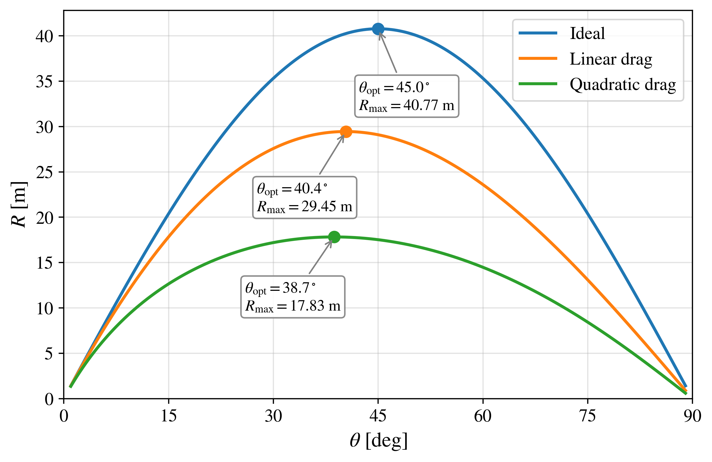

# Comparative Analysis

## Physical interpretation across the three projectile-motion models

This section brings together the results obtained from the three projectile-motion models studied in this repository:

- ideal projectile motion;
- projectile motion with linear air resistance;
- projectile motion with quadratic air resistance.

The purpose is not to repeat the derivations developed in the individual model folders, but to compare their physical predictions and answer the questions raised in the initial [`overview/`](../overview/).

The comparison emphasizes an important physical idea:

> Familiar results from elementary projectile motion, such as the parabolic trajectory, complementary-angle symmetry, and the optimal launch angle of $45^\circ$, arise from the assumptions of the ideal model and should not be interpreted as universal properties of projectile motion.

---

## 1. Reference case

To compare the three models directly, the horizontal range is calculated as a function of the launch angle while the initial speed is fixed at

$$
v_0 = 20.0\ \mathrm{m/s}.
$$

For the dissipative models, the reference parameters are

$$
\gamma = 0.2\ \mathrm{s^{-1}}
$$

for linear drag, and

$$
\kappa = 0.05\ \mathrm{m^{-1}}
$$

for quadratic drag.

The launch angle $\theta$ is varied while these quantities remain fixed.

It is important to emphasize that $\gamma$ and $\kappa$ belong to different drag laws and have different physical dimensions. Their numerical values therefore do not represent equivalent measures of aerodynamic resistance.

Consequently, the numerical values of the maximum range and optimal launch angle reported below correspond specifically to this reference case. They should not be interpreted as universal values for the linear- and quadratic-drag models.

The broader dependence on the physical parameters is explored through the parameter maps presented in the individual model folders.

---

## 2. Horizontal range and optimal launch angle

The following figure compares the horizontal range $R(\theta)$ predicted by the three models.

High-resolution PDF:

[Download PDF](range_angle_comparison.pdf)

For the reference conditions considered here, the maxima are:

| Model | $\theta_{\mathrm{opt}}$ | $R_{\max}$ |
|:---|---:|---:|
| Ideal | $45.0^\circ$ | $40.77\ \mathrm{m}$ |
| Linear drag | $40.4^\circ$ | $29.45\ \mathrm{m}$ |
| Quadratic drag | $38.7^\circ$ | $17.83\ \mathrm{m}$ |

Two effects are immediately visible.

First, air resistance reduces the horizontal range relative to the ideal prediction.

Second, for the dissipative cases considered here, the maximum of $R(\theta)$ is displaced toward angles below $45^\circ$.

Thus, introducing air resistance changes not only how far the projectile travels, but also the launch condition that maximizes that distance.

---

## 3. How large is the reduction in range?

The ideal model provides the reference maximum range

$$
R_{\max}^{\mathrm{ideal}} = 40.77\ \mathrm{m}.
$$

For the linear-drag case,

$$
R_{\max}^{\mathrm{linear}} = 29.45\ \mathrm{m}.
$$

The ratio with respect to the ideal result is

$$
\frac{R_{\max}^{\mathrm{linear}}}
{R_{\max}^{\mathrm{ideal}}}
= \frac{29.45}{40.77}
\approx 0.722.
$$

Therefore, for the selected parameters, the linear-drag projectile reaches approximately $72.2 \%$ of the ideal maximum range.

The corresponding reduction is approximately $27.8 \%$.

For the quadratic-drag case,

$$
R_{\max}^{\mathrm{quadratic}} = 17.83\ \mathrm{m}.
$$

The corresponding ratio is

$$
\frac{R_{\max}^{\mathrm{quadratic}}}
{R_{\max}^{\mathrm{ideal}}}
= \frac{17.83}{40.77}
\approx 0.437.
$$

Thus, for the selected parameters, the quadratic-drag projectile reaches approximately $43.7\%$ of the ideal maximum range.

The corresponding reduction is approximately $56.3\%$.

The results for this reference case can be summarized as follows:

| Model | $R_{\max}$ | Fraction of ideal range | Reduction |
|:---|---:|---:|---:|
| Ideal | $40.77\ \mathrm{m}$ | $1.000$ | $0\%$ |
| Linear drag | $29.45\ \mathrm{m}$ | $0.722$ | $27.8\%$ |
| Quadratic drag | $17.83\ \mathrm{m}$ | $0.437$ | $56.3\%$ |

These percentages characterize only the particular reference conditions used in the figure.

The larger reduction obtained for the quadratic-drag curve in this example should not be interpreted as a universal statement that quadratic drag always produces a stronger reduction than linear drag. The two models involve different force laws and parameters with different physical dimensions.

---

## 4. Why is $45^\circ$ special in the ideal model?

For a projectile launched and landing at the same height, the ideal horizontal range is

$$
R_{\mathrm{ideal}}(\theta)
=
\frac{v_0^2}{g}\sin(2\theta).
$$

For fixed $v_0$ and $g$, maximizing the range is equivalent to maximizing

$$
\sin(2\theta).
$$

The maximum value occurs when

$$
2\theta = 90^\circ.
$$

Therefore,

$$
\theta_{\mathrm{opt}}^{\mathrm{ideal}} = 45^\circ.
$$

Under the assumptions of the ideal model, this result does not depend on the magnitude of $v_0$.

This observation is physically important. The familiar statement that a projectile achieves maximum horizontal range at $45^\circ$ is not a universal law of projectile motion. It follows from a particular set of assumptions:

- uniform gravitational acceleration;
- negligible air resistance;
- fixed initial speed;
- equal launch and landing heights.

Changing those assumptions can change the optimal angle.

---

## 5. What happens to complementary launch angles?

The ideal range satisfies

$$
R_{\mathrm{ideal}}(\theta)
=
R_{\mathrm{ideal}}(90^\circ-\theta).
$$

This follows from the trigonometric relation

$$
\sin(2\theta)
=
\sin\left(180^\circ-2\theta\right).
$$

Therefore, complementary launch angles produce the same horizontal range in the ideal model.

For example,

$$
R_{\mathrm{ideal}}(30^\circ)
=
R_{\mathrm{ideal}}(60^\circ).
$$

This symmetry is visible in the ideal $R(\theta)$ curve, whose maximum occurs at

$$
\theta = 45^\circ.
$$

When velocity-dependent air resistance is introduced, this simple symmetry is generally lost.

A low-angle and a high-angle trajectory do not experience dynamically equivalent motion. They have different flight times, different velocity histories, and different cumulative interactions with the resistive force.

Therefore, in general,

$$
R_{\mathrm{drag}}(\theta)
\neq
R_{\mathrm{drag}}(90^\circ-\theta).
$$

The displacement of the maxima away from $45^\circ$ in the dissipative curves is one visible consequence of this loss of ideal symmetry.

---

## 6. Does the optimal angle remain $45^\circ$ when drag is present?

For the reference case shown in the figure,

$$
\theta_{\mathrm{opt}}^{\mathrm{ideal}}
=
45.0^\circ,
$$

$$
\theta_{\mathrm{opt}}^{\mathrm{linear}}
=
40.4^\circ,
$$

and

$$
\theta_{\mathrm{opt}}^{\mathrm{quadratic}}
=
38.7^\circ.
$$

The displacement relative to the ideal result is therefore

$$
\Delta\theta_{\mathrm{linear}}
=
45.0^\circ-40.4^\circ
=
4.6^\circ,
$$

and

$$
\Delta\theta_{\mathrm{quadratic}}
=
45.0^\circ-38.7^\circ
=
6.3^\circ.
$$

These particular numerical values depend on the parameters used in the calculation.

More generally, for the linear-drag model the optimal angle depends on quantities such as the initial speed and the linear-drag parameter:

$$
\theta_{\mathrm{opt}}^{\mathrm{linear}}
=
\theta_{\mathrm{opt}}(v_0,\gamma).
$$

For quadratic drag,

$$
\theta_{\mathrm{opt}}^{\mathrm{quadratic}}
=
\theta_{\mathrm{opt}}(v_0,\kappa).
$$

This differs fundamentally from the ideal result, for which the optimal angle is $45^\circ$ under equal launch and landing heights.

---

## 7. Why can drag favor lower launch angles?

The physical origin of the shift can be understood from the competition between horizontal motion and flight time.

The initial velocity components are

$$
v_{0x}=v_0\cos(\theta)
$$

and

$$
v_{0y}=v_0\sin(\theta).
$$

Increasing the launch angle increases the initial vertical component but decreases the initial horizontal component.

In the ideal model, increasing the vertical component can increase the flight time without introducing any aerodynamic loss. The balance between horizontal velocity and flight time leads to the familiar optimum at $45^\circ$.

When air resistance is present, a longer flight also means that the resistive force acts over a longer time. In addition, the horizontal velocity decreases continuously during the motion.

The balance between horizontal velocity and flight time is therefore modified.

For the dissipative cases explored in this repository, the maximum horizontal range occurs at an angle below $45^\circ$.

The important physical conclusion is therefore not simply that air resistance reduces the range. Air resistance can also modify the optimization problem itself.

---

## 8. What do the parameter sweeps tell us beyond this reference case?

The $R(\theta)$ comparison shown above represents one particular cross-section of a larger parameter space.

The broader behavior is explored through the parameter maps developed in the individual model folders.

For the ideal model,

$$
R = R(v_0,\theta).
$$

This map shows how the horizontal range changes simultaneously with initial speed and launch angle.

For linear drag, the corresponding analysis considers

$$
R = R(\theta,\gamma)
$$

for fixed $v_0$.

For quadratic drag, the parameter study considers

$$
R = R(\theta,\kappa)
$$

for fixed $v_0$.

These maps demonstrate that the range should not be interpreted as the result of a single isolated trajectory. Instead, it belongs to a continuous parameter landscape.

In the dissipative models, changing the drag parameter modifies the entire dependence of the range on the launch angle.

Therefore, the final $R(\theta)$ comparison should be interpreted as a representative cross-section of the broader parameter space explored in the individual model folders, rather than as a universal quantitative comparison between the two drag laws.

---

## 9. How is the ideal model recovered?

The three models are not completely disconnected descriptions.

The dissipative models recover the ideal equations when their corresponding drag parameters vanish.

For linear drag,

$$
\gamma \rightarrow 0.
$$

In this limit, the drag term disappears and the governing equations reduce to

$$
\frac{dv_x}{dt}=0
$$

and

$$
\frac{dv_y}{dt}=-g.
$$

Therefore, the ideal trajectory is recovered.

Similarly, for quadratic drag,

$$
\kappa \rightarrow 0,
$$

and the quadratic resistance terms vanish.

The governing equations again reduce to the ideal projectile equations.

At the level of the horizontal range, this behavior can be expressed as

$$
\lim_{\gamma\rightarrow0}
R_{\mathrm{linear}}(\theta,\gamma)
=
R_{\mathrm{ideal}}(\theta),
$$

and

$$
\lim_{\kappa\rightarrow0}
R_{\mathrm{quadratic}}(\theta,\kappa)
=
R_{\mathrm{ideal}}(\theta).
$$

This limiting behavior is important because it connects the three levels of modeling.

The ideal model is not simply an unrelated textbook case. It appears naturally as the zero-drag limit of the dissipative descriptions.

---

## 10. What does changing the initial speed teach us?

The trajectory studies performed for the three models also illustrate the role of the initial speed.

For the ideal model,

$$
R_{\mathrm{ideal}}
=
\frac{v_0^2}{g}\sin(2\theta).
$$

At fixed launch angle,

$$
R_{\mathrm{ideal}} \propto v_0^2.
$$

The dependence is therefore simple and known exactly.

When drag is introduced, increasing $v_0$ has competing consequences.

The projectile begins with a greater speed and can potentially travel farther, but the resistive force also becomes larger because it depends on the instantaneous velocity.

For linear drag,

$$
|\mathbf{F}_d| \propto v,
$$

whereas for quadratic drag,

$$
|\mathbf{F}_d| \propto v^2.
$$

Consequently, the dependence of the range on $v_0$ is no longer described by the simple ideal scaling.

This illustrates an important modeling principle: a parameter that produces a simple scaling law in an idealized problem can acquire a more complicated role when additional physical interactions are included.

---

## 11. Linear and quadratic drag are not interchangeable

Both dissipative models introduce a force opposite to the direction of motion, but their physical and mathematical structures are different.

For linear drag,

$$
\mathbf{F}_d=-b\mathbf{v},
$$

and therefore

$$
|\mathbf{F}_d| \propto v.
$$

For quadratic drag,

$$
\mathbf{F}_d=-c|\mathbf{v}|\mathbf{v},
$$

so that

$$
|\mathbf{F}_d| \propto v^2.
$$

The normalized parameters are

$$
\gamma=\frac{b}{m}
$$

and

$$
\kappa=\frac{c}{m}.
$$

Their dimensions are different:

$$
[\gamma]=\mathrm{s^{-1}},
$$

whereas

$$
[\kappa]=\mathrm{m^{-1}}.
$$

Consequently, a numerical value assigned to $\gamma$ cannot be compared directly with the same numerical value assigned to $\kappa$.

The purpose of comparing the two models is not to identify one parameter value with the other, but to investigate how different assumptions about the velocity dependence of the resistive force modify the predicted motion.

---

## 12. From analytical to numerical modeling

One of the central features of this project is the progressive change in mathematical complexity across the three models.

### Ideal projectile motion

The equations are uncoupled and the acceleration is constant.

The complete trajectory can be obtained analytically using elementary functions.

At the same time, numerical integration can reproduce the exact trajectory and provide a direct validation of the computational implementation.

### Linear air resistance

The equations remain analytically solvable, but the solutions contain exponential functions.

The analytical and numerical trajectories can again be compared directly.

An additional mathematical feature appears when characteristic quantities such as the flight time are calculated. Although $x(t)$ and $y(t)$ are known analytically, the nonzero flight time is determined from the condition

$$
y(T)=0,
$$

which leads to a transcendental equation.

Thus, having an analytical expression for the trajectory does not necessarily imply that every derived physical quantity has a simple elementary expression.

This provides a natural example in which analytical and numerical methods already begin to work together.

### Quadratic air resistance

For quadratic drag, the instantaneous speed is

$$
v=\sqrt{v_x^2+v_y^2}.
$$

The velocity equations are

$$
\frac{dv_x}{dt}
=
-\kappa v v_x
$$

and

$$
\frac{dv_y}{dt}
=
-g-\kappa v v_y.
$$

The horizontal and vertical velocity components are therefore nonlinearly coupled through $v$.

For the complete two-dimensional problem considered here, a general closed-form trajectory suitable for the same direct analytical treatment is not available.

Numerical integration consequently becomes the practical method for obtaining the motion.

The progression can therefore be summarized as

$$
\mathrm{Ideal}
\quad\longrightarrow\quad
\mathrm{Linear\ drag}
\quad\longrightarrow\quad
\mathrm{Quadratic\ drag}.
$$

From the point of view of the solution strategy, this corresponds to

$$
\mathrm{analytical}
\quad\longrightarrow\quad
\mathrm{analytical\ and\ numerical}
\quad\longrightarrow\quad
\mathrm{numerical}.
$$

---

## 13. Why use numerical methods when an analytical solution exists?

The numerical method becomes useful before it becomes strictly necessary.

For the ideal model, numerical integration can be compared with a simple exact solution.

For linear drag, the numerical trajectory can be compared with a more involved exact solution containing exponential functions.

Agreement in these analytically solvable cases provides a direct validation of the numerical implementation.

Once this validation has been established, the same computational strategy can be applied to the quadratic-drag problem, where numerical integration becomes essential for the complete trajectory.

Numerical computation also allows systematic parameter exploration.

Instead of studying only isolated trajectories, the computational framework can investigate quantities such as

$$
R(v_0,\theta),
$$

$$
R(\theta,\gamma),
$$

and

$$
R(\theta,\kappa).
$$

The numerical method therefore plays two complementary roles:

1. **validation**, when analytical solutions are available;
2. **solution and exploration**, when the equations or parameter space make a purely analytical treatment impractical.

Analytical and numerical methods should therefore be viewed as complementary tools rather than competing approaches.

---

## 14. Answers to the questions raised in the overview

The initial [`overview/`](../overview/) introduced several questions. The results obtained from the three models now allow them to be answered.

### How does the launch angle modify the trajectory?

The launch angle determines how the initial speed is distributed between horizontal and vertical motion. This controls the competition between horizontal displacement and flight time. When drag is present, this competition is additionally modified by velocity-dependent dissipation.

### How does increasing the initial speed affect the motion?

Increasing $v_0$ generally increases the characteristic distances reached by the projectile. In the ideal model, the horizontal range follows a simple quadratic dependence on $v_0$. With drag, the behavior becomes more complex because the resistive force itself depends on speed.

### How does air resistance modify the trajectory?

Air resistance decreases the projectile velocity during flight, reduces the horizontal range, changes the trajectory from the ideal parabolic form, and modifies the conditions that maximize the range.

### Does the symmetry between complementary launch angles survive?

It is exact in the ideal model for equal launch and landing heights. It is generally lost when velocity-dependent air resistance is introduced.

### Is $45^\circ$ always the optimal launch angle?

No.

It is the optimal angle for the ideal model under the assumptions considered here. In dissipative motion, the optimal angle depends on the physical parameters of the problem.

### How does the optimal angle change when resistance is introduced?

For the reference cases studied here, the optimum shifts below $45^\circ$.

The exact value depends on the initial speed and the corresponding drag parameter.

### Are linear and quadratic drag equivalent?

No.

They represent different dependencies of the resistive force on speed and contain parameters with different physical dimensions.

### How is the ideal model recovered?

The ideal equations are obtained in the limits

$$
\gamma\rightarrow0
$$

and

$$
\kappa\rightarrow0
$$

for the linear- and quadratic-drag models, respectively.

### When does numerical integration become necessary?

Within the progression considered here, numerical integration becomes essential for the complete quadratic-drag problem because the horizontal and vertical velocity equations are nonlinearly coupled.

---

## 15. Pedagogical significance

Projectile motion is commonly introduced as one of the first applications of Newton's second law because the ideal problem leads to a simple and elegant analytical solution.

That simplicity makes the problem pedagogically useful, but it can also create the impression that familiar results such as a parabolic trajectory, complementary-angle symmetry, or an optimal launch angle of $45^\circ$ are intrinsic properties of projectile motion.

The progression developed in this repository provides a way to examine those assumptions.

Students first encounter the ideal model, for which the governing equations can be solved exactly and the physical predictions are transparent.

They then introduce linear resistance. The physical model becomes more realistic and the mathematical treatment becomes more involved, but an analytical solution remains available. The numerical result can therefore be compared directly with the exact solution.

The linear model also illustrates an important intermediate situation: even when the trajectory is known analytically, some derived quantities may still require numerical procedures. The flight time, for example, is obtained from a transcendental equation.

Finally, quadratic resistance changes the mathematical structure of the problem. The velocity components become nonlinearly coupled, and numerical integration becomes the natural computational approach.

The same familiar mechanics problem therefore connects several important concepts:

- Newton's second law;
- physical assumptions and approximations;
- ordinary differential equations;
- analytical solutions;
- numerical integration;
- root-finding methods;
- computational validation;
- parameter exploration;
- optimization;
- scientific visualization;
- and physical interpretation.

Most importantly, this progression helps explain **why numerical methods are introduced**.

Numerical computation is not used simply because a computer is available. It first provides an independent way to reproduce known analytical results, then complements an analytical treatment when derived quantities require numerical procedures, and finally becomes essential when the mathematical structure of the model no longer permits the same type of closed-form solution.

The progression

$$
\mathrm{analytical}
\quad\longrightarrow\quad
\mathrm{analytical\ plus\ numerical}
\quad\longrightarrow\quad
\mathrm{numerical}
$$

can therefore be studied within a single physical problem.

This makes projectile motion a useful pedagogical bridge between introductory mechanics, differential equations, and computational physics.

---

## 16. Main physical conclusions

The comparison of the three models leads to the following conclusions.

1. The parabolic trajectory is a consequence of the ideal approximation and is not preserved when velocity-dependent air resistance is included.

2. Air resistance reduces the horizontal range relative to the corresponding ideal prediction.

3. The complementary-angle symmetry of the ideal model is generally lost in dissipative motion.

4. The ideal result

   $$
   \theta_{\mathrm{opt}}=45^\circ
   $$

   is not universal. In dissipative motion, the optimal angle depends on the physical parameters of the problem.

5. For the specific reference conditions

   $$
   v_0=20.0\ \mathrm{m/s},
   $$

   $$
   \gamma=0.2\ \mathrm{s^{-1}},
   $$

   and

   $$
   \kappa=0.05\ \mathrm{m^{-1}},
   $$

   the optimal angles are $45.0^\circ$, $40.4^\circ$, and $38.7^\circ$ for the ideal, linear-drag, and quadratic-drag models, respectively.

6. For the same reference case, the corresponding maximum ranges are $40.77\ \mathrm{m}$, $29.45\ \mathrm{m}$, and $17.83\ \mathrm{m}$.

7. The numerical values obtained for the dissipative models characterize the selected parameter set and should not be interpreted as universal properties of linear or quadratic drag.

8. Linear and quadratic drag represent different physical assumptions. Their parameters have different dimensions and cannot be compared directly by numerical value alone.

9. The parameter maps demonstrate that a single trajectory or a single reference case provides only one view of the problem. Computational exploration reveals how the predictions evolve throughout parameter space.

10. The dissipative models recover the ideal behavior when their corresponding drag parameters approach zero.

11. Analytical solutions provide both physical insight and benchmarks for validating numerical calculations.

12. The quadratic-drag model illustrates how increasing physical and mathematical complexity can make numerical integration the practical route for studying the complete trajectory.

Taken together, these results illustrate a broader lesson:

> Increasing the physical realism of a model can change not only its quantitative predictions, but also its mathematical structure and the methods required to study it.

---

## 17. Python code and figure files

The comparative figure presented in this section is generated by

[`range_angle_comparison.py`](range_angle_comparison.py)

with graphical outputs:

- [`range_angle_comparison.png`](range_angle_comparison.png)
- [`range_angle_comparison.pdf`](range_angle_comparison.pdf)

The broader parameter studies supporting this comparison are available in:

- [`../ideal_model/`](../ideal_model/)
- [`../linear_drag/`](../linear_drag/)
- [`../quadratic_drag/`](../quadratic_drag/)

---

## Repository home

Return to the main repository:

[`../README.md`](../README.md)

---
