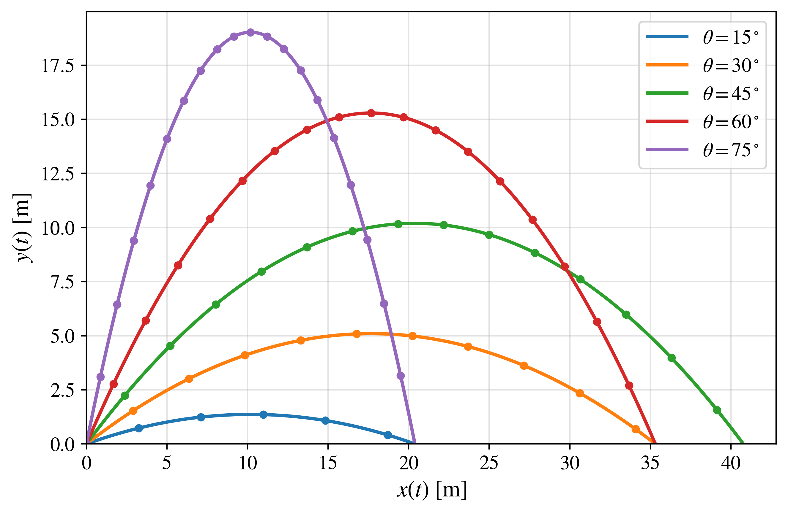
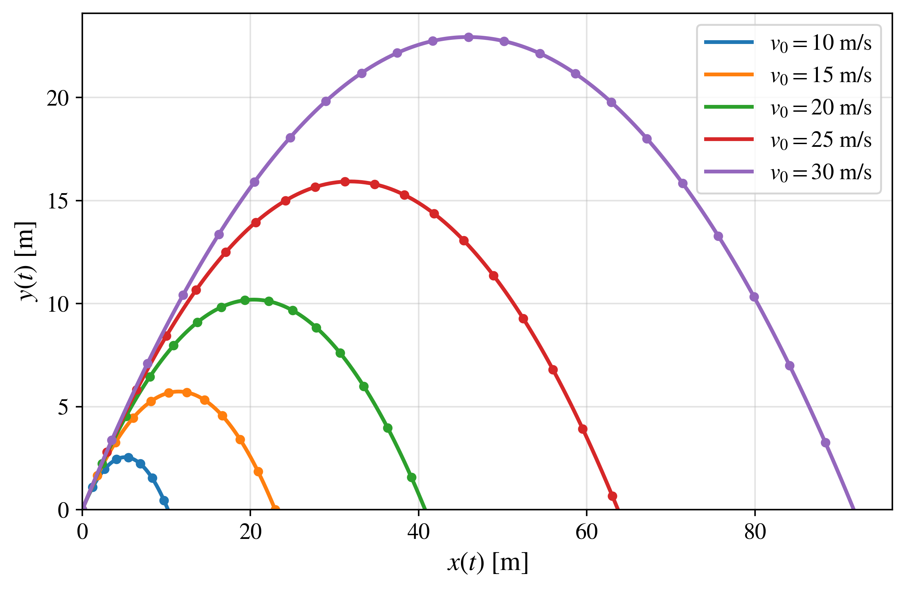

# Projectile Motion in Python

## Ideal Projectile Model

The ideal projectile model describes the motion of a particle subjected only to a constant gravitational force. Air resistance, wind, rotation, and any other aerodynamic effects are neglected.

Although this is one of the simplest models in classical mechanics, it provides a useful starting point for connecting analytical solutions, numerical integration, and Python visualizations.

---

## 📖 1. Physical description

A projectile is launched from the origin with initial speed $v_0$ and launch angle \(\theta\), measured with respect to the horizontal axis.

The following assumptions are considered:

- the projectile is treated as a point particle;
- gravitational acceleration is constant;
- the motion takes place close to Earth's surface;
- air resistance is neglected;
- the initial position is

$$
x(0)=0,
\qquad
y(0)=0;
$$

- the initial velocity components are

$$
v_x(0)=v_0\cos\theta,
\qquad
v_y(0)=v_0\sin\theta.
$$

Under these assumptions, the only force acting on the projectile is its weight.

---

## ⚙️ 2. Governing equations

According to Newton's second law,

$$
m\frac{d^2\mathbf{r}}{dt^2}=\mathbf{F},
$$

where

$$
\mathbf{r}(t)=x(t)\,\hat{\mathbf{x}}+y(t)\,\hat{\mathbf{y}}.
$$

For the ideal model, the force is

$$
\mathbf{F}=-mg\,\hat{\mathbf{y}}.
$$

Therefore,

$$
m\frac{d^2x}{dt^2}=0,
$$

and

$$
m\frac{d^2y}{dt^2}=-mg.
$$

After dividing by the mass, the governing equations become

$$
\boxed{
\frac{d^2x}{dt^2}=0
}
$$

and

$$
\boxed{
\frac{d^2y}{dt^2}=-g.
}
$$

The horizontal acceleration is zero, whereas the vertical acceleration is constant and directed downward.

---

## 📐 3. Analytical solution

### Horizontal motion

The horizontal equation is

$$
\frac{d^2x}{dt^2}=0.
$$

Using

$$
v_x=\frac{dx}{dt},
$$

we obtain

$$
\frac{dv_x}{dt}=0.
$$

Integrating with respect to time gives

$$
v_x(t)=C_1.
$$

The initial condition

$$
v_x(0)=v_0\cos\theta
$$

implies

$$
C_1=v_0\cos\theta.
$$

Therefore,

$$
\boxed{
v_x(t)=v_0\cos\theta.
}
$$

Since

$$
\frac{dx}{dt}=v_0\cos\theta,
$$

a second integration gives

$$
x(t)=v_0\cos\theta\,t+C_2.
$$

Using

$$
x(0)=0,
$$

we obtain

$$
C_2=0.
$$

Thus, the horizontal position is

$$
\boxed{
x(t)=v_0\cos\theta\,t.
}
$$

---

### Vertical motion

The vertical equation is

$$
\frac{d^2y}{dt^2}=-g.
$$

Using

$$
v_y=\frac{dy}{dt},
$$

we obtain

$$
\frac{dv_y}{dt}=-g.
$$

Integrating with respect to time gives

$$
v_y(t)=-gt+C_3.
$$

The initial condition

$$
v_y(0)=v_0\sin\theta
$$

implies

$$
C_3=v_0\sin\theta.
$$

Therefore,

$$
\boxed{
v_y(t)=v_0\sin\theta-gt.
}
$$

Since

$$
\frac{dy}{dt}=v_0\sin\theta-gt,
$$

a second integration gives

$$
y(t)=v_0\sin\theta\,t-\frac{1}{2}gt^2+C_4.
$$

Using

$$
y(0)=0,
$$

we obtain

$$
C_4=0.
$$

Thus, the vertical position is

$$
\boxed{
y(t)=v_0\sin\theta\,t-\frac{1}{2}gt^2.
}
$$

---

### Parametric solution

The complete analytical solution is therefore

$$
\boxed{
x(t)=v_0\cos\theta\,t
}
$$

and

$$
\boxed{
y(t)=v_0\sin\theta\,t-\frac{1}{2}gt^2.
}
$$

These two equations describe the trajectory parametrically, with time \(t\) as the parameter.

---

### Cartesian trajectory \(y(x)\)

To obtain the trajectory directly as a function of the horizontal position, time is eliminated from the parametric equations.

From

$$
x(t)=v_0\cos\theta\,t,
$$

we solve for time:

$$
t=\frac{x}{v_0\cos\theta}.
$$

Substituting this expression into

$$
y(t)=v_0\sin\theta\,t-\frac{1}{2}gt^2,
$$

we obtain

$$
y(x)
=
v_0\sin\theta
\left(
\frac{x}{v_0\cos\theta}
\right)
-
\frac{1}{2}g
\left(
\frac{x}{v_0\cos\theta}
\right)^2.
$$

Simplifying the first term,

$$
v_0\sin\theta
\left(
\frac{x}{v_0\cos\theta}
\right)
=
x\tan\theta.
$$

Simplifying the second term,

$$
\frac{1}{2}g
\left(
\frac{x}{v_0\cos\theta}
\right)^2
=
\frac{g}{2v_0^2\cos^2\theta}x^2.
$$

Therefore, the Cartesian trajectory is

$$
\boxed{
y(x)
=
x\tan\theta
-
\frac{g}{2v_0^2\cos^2\theta}x^2.
}
$$

This expression is quadratic in \(x\). Consequently, the trajectory of an ideal projectile is a parabola.

This analytical expression will be used to generate the continuous curves in the figures of this section.

---

### Flight time

The projectile returns to the ground when

$$
y(T)=0.
$$

Using

$$
y(T)=v_0\sin\theta\,T-\frac{1}{2}gT^2,
$$

we obtain

$$
T
\left(
v_0\sin\theta-\frac{1}{2}gT
\right)=0.
$$

The first solution,

$$
T=0,
$$

corresponds to the launch instant.

The nonzero solution is

$$
\boxed{
T=\frac{2v_0\sin\theta}{g}.
}
$$

---

### Horizontal range

The horizontal range is obtained by evaluating \(x(t)\) at the total flight time:

$$
R=x(T).
$$

Therefore,

$$
R
=
v_0\cos\theta
\left(
\frac{2v_0\sin\theta}{g}
\right).
$$

Using

$$
2\sin\theta\cos\theta=\sin(2\theta),
$$

we obtain

$$
\boxed{
R=\frac{v_0^2}{g}\sin(2\theta).
}
$$

For a fixed initial speed, the maximum horizontal range occurs when

$$
\sin(2\theta)=1.
$$

Thus,

$$
2\theta=90^\circ,
$$

and consequently,

$$
\boxed{
\theta_{\mathrm{max}}=45^\circ.
}
$$

Complementary launch angles satisfy

$$
R(\theta)=R(90^\circ-\theta).
$$

Therefore, for example, \(30^\circ\) and \(60^\circ\) produce the same horizontal range in the ideal model.

---

### Maximum height

The maximum height is reached when the vertical velocity becomes zero:

$$
v_y(t_H)=0.
$$

Using

$$
v_y(t)=v_0\sin\theta-gt,
$$

we obtain

$$
t_H=\frac{v_0\sin\theta}{g}.
$$

Substituting this time into \(y(t)\),

$$
H_{\max}
=
v_0\sin\theta
\left(
\frac{v_0\sin\theta}{g}
\right)
-
\frac{1}{2}g
\left(
\frac{v_0\sin\theta}{g}
\right)^2.
$$

After simplification,

$$
\boxed{
H_{\max}
=
\frac{v_0^2\sin^2\theta}{2g}.
}
$$

---

## 💻 4. Numerical implementation

For the numerical solution, the second-order equations are rewritten as a first-order system.

Defining

$$
v_x=\frac{dx}{dt},
\qquad
v_y=\frac{dy}{dt},
$$

the system becomes

$$
\frac{dx}{dt}=v_x,
$$

$$
\frac{dy}{dt}=v_y,
$$

$$
\frac{dv_x}{dt}=0,
$$

and

$$
\frac{dv_y}{dt}=-g.
$$

The corresponding state vector is

$$
\mathbf{u}(t)
=
\begin{pmatrix}
x(t)\\
y(t)\\
v_x(t)\\
v_y(t)
\end{pmatrix}.
$$

The numerical integration is performed using SciPy's `solve_ivp` function.

The integration begins with

$$
\mathbf{u}(0)
=
\begin{pmatrix}
0\\
0\\
v_0\cos\theta\\
v_0\sin\theta
\end{pmatrix},
$$

and stops when the projectile returns to

$$
y=0
$$

during the descending part of the motion.

For the figures:

- continuous lines represent the analytical solution;
- discrete markers represent the numerical solution.

The agreement between both solutions provides a direct validation of the numerical implementation.

---

## 🐍 5. Python codes

| Program | Description |
|:---|:---|
| `analytical_solution.py` | Computes the trajectory using the exact analytical expression \(y(x)\). |
| `numerical_solution.py` | Integrates the governing differential equations numerically. |
| `analytical_numerical_comparison.py` | Superposes the analytical and numerical trajectories. |

The comparison program will generate two figures:

1. variation of the launch angle \(\theta\) for fixed \(v_0\);
2. variation of the initial speed \(v_0\) for fixed \(\theta\).

---

## 📈 6. Generated figures

### Variation of the launch angle

The launch angle is varied while the initial speed remains fixed.

Continuous curves correspond to the analytical solution, whereas numerical results are represented by discrete markers.

<!--

-->

High-resolution PDF:

<!--
[Download PDF](ideal_angle_variation.pdf)
-->

---

### Variation of the initial speed

The initial speed is varied while the launch angle remains fixed.

Continuous curves correspond to the analytical solution, whereas numerical results are represented by discrete markers.

<!--

-->

High-resolution PDF:

<!--
[Download PDF](ideal_velocity_variation.pdf)
-->

---

## ▶️ 7. How to run the programs

Install the required packages from the repository root:

```bash
pip install -r requirements.txt
```

Then enter the `ideal_model` folder and execute the desired program:

```bash
python analytical_solution.py
```

```bash
python numerical_solution.py
```

```bash
python analytical_numerical_comparison.py
```

The programs will generate PNG figures for visualization in GitHub and PDF figures for use in the associated article.

---

## 📚 8. References

Classical mechanics and projectile-motion references will be added after the theoretical section of the associated article is finalized.
