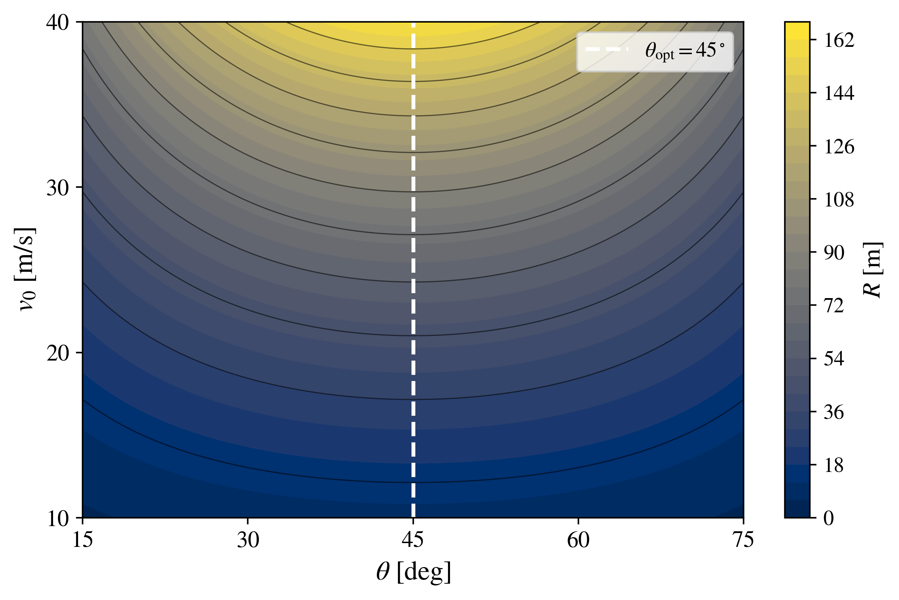

# Projectile Motion in Python

## Ideal Projectile Model

The ideal projectile model describes the motion of a particle subjected only to a constant gravitational force. Air resistance, wind, rotation, and other aerodynamic effects are neglected.

Although this is the simplest of the three models considered in this repository, it provides the fundamental reference against which the effects of linear and quadratic air resistance will later be compared. It also offers an ideal setting for connecting analytical mechanics, numerical integration, and computational visualization.

Because an exact analytical solution is available, the ideal model allows the numerical implementation to be validated directly before applying the same computational methodology to progressively more complex situations.

---

## 📖 1. Physical description

A projectile is launched from the origin with initial speed $v_0$ and launch angle $\theta$, measured with respect to the horizontal axis.

The following assumptions are considered:

- the projectile is treated as a point particle;
- gravitational acceleration is constant;
- the motion takes place close to Earth's surface;
- air resistance is neglected;
- wind and other aerodynamic effects are neglected;
- the initial position is

$$
x(0)=0,\qquad y(0)=0;
$$

- the initial velocity components are

$$
v_x(0)=v_0\cos(\theta),\qquad v_y(0)=v_0\sin(\theta).
$$

Under these assumptions, the only force acting on the projectile after launch is its weight,

$$
\mathbf{F}=-mg\hat{\mathbf{y}}.
$$

The absence of a horizontal force implies that the horizontal velocity remains constant, whereas gravity continuously modifies the vertical component of the velocity.

This separation between horizontal and vertical motion is one of the characteristic features of the ideal projectile model.

---

## ⚙️ 2. Governing equations

According to Newton's second law,

$$
m\frac{d^2\mathbf{r}}{dt^2}=\mathbf{F},
$$

where the position vector is

$$
\mathbf{r}(t)=x(t)\hat{\mathbf{x}}+y(t)\hat{\mathbf{y}}.
$$

For the ideal projectile,

$$
\mathbf{F}=-mg\hat{\mathbf{y}}.
$$

Therefore,

$$
m\frac{d^2x}{dt^2}=0,
$$

and

$$
m\frac{d^2y}{dt^2}=-mg.
$$

Dividing by the mass gives the governing differential equations

$$
\boxed{\frac{d^2x}{dt^2}=0}
$$

and

$$
\boxed{\frac{d^2y}{dt^2}=-g}.
$$

The first equation describes uniform horizontal motion, whereas the second describes uniformly accelerated vertical motion.

---

## 📐 3. Analytical solution

### Horizontal motion

The horizontal equation is

$$
\frac{d^2x}{dt^2}=0.
$$

Using

$$
v_x=\frac{dx}{dt},
$$

we obtain

$$
\frac{dv_x}{dt}=0.
$$

Integrating with respect to time gives

$$
v_x(t)=C_1.
$$

The initial condition

$$
v_x(0)=v_0\cos(\theta)
$$

implies

$$
C_1=v_0\cos(\theta).
$$

Therefore,

$$
\boxed{v_x(t)=v_0\cos(\theta)}.
$$

The horizontal velocity is consequently constant throughout the complete motion.

Since

$$
\frac{dx}{dt}=v_0\cos(\theta),
$$

integration gives

$$
x(t)=v_0\cos(\theta)t+C_2.
$$

Using the initial condition

$$
x(0)=0,
$$

we obtain

$$
C_2=0.
$$

Thus,

$$
\boxed{x(t)=v_0\cos(\theta)t}.
$$

The horizontal position therefore increases linearly with time.

---

### Vertical motion

The vertical equation is

$$
\frac{d^2y}{dt^2}=-g.
$$

Using

$$
v_y=\frac{dy}{dt},
$$

we obtain

$$
\frac{dv_y}{dt}=-g.
$$

Integrating gives

$$
v_y(t)=-gt+C_3.
$$

The initial condition

$$
v_y(0)=v_0\sin(\theta)
$$

implies

$$
C_3=v_0\sin(\theta).
$$

Therefore,

$$
\boxed{v_y(t)=v_0\sin(\theta)-gt}.
$$

The vertical velocity decreases linearly with time because gravity acts continuously in the downward direction.

During the ascending part of the motion, $v_y>0$. At the maximum height,

$$
v_y=0,
$$

and during the descending part,

$$
v_y<0.
$$

Since

$$
\frac{dy}{dt}=v_0\sin(\theta)-gt,
$$

a second integration gives

$$
y(t)=v_0\sin(\theta)t-\frac{1}{2}gt^2+C_4.
$$

Using

$$
y(0)=0,
$$

we obtain

$$
C_4=0.
$$

Thus,

$$
\boxed{y(t)=v_0\sin(\theta)t-\frac{1}{2}gt^2}.
$$

---

### Parametric solution

The complete analytical solution of the ideal projectile is therefore

$$
\boxed{x(t)=v_0\cos(\theta)t}
$$

and

$$
\boxed{y(t)=v_0\sin(\theta)t-\frac{1}{2}gt^2}.
$$

Together, these equations provide a complete parametric description of the trajectory, with time $t$ acting as the parameter.

---

### Cartesian trajectory $y(x)$

To obtain the trajectory directly as a function of the horizontal coordinate, the time parameter can be eliminated.

From

$$
x(t)=v_0\cos(\theta)t,
$$

we obtain

$$
t=\frac{x}{v_0\cos(\theta)}.
$$

Substituting this expression into

$$
y(t)=v_0\sin(\theta)t-\frac{1}{2}gt^2,
$$

gives

$$
y(x)=v_0\sin(\theta)\left(\frac{x}{v_0\cos(\theta)}\right)-\frac{g}{2}\left(\frac{x}{v_0\cos(\theta)}\right)^2.
$$

The first term becomes

$$
v_0\sin(\theta)\left(\frac{x}{v_0\cos(\theta)}\right)=x\tan(\theta),
$$

whereas the second term becomes

$$
\frac{g}{2}\left(\frac{x}{v_0\cos(\theta)}\right)^2=\frac{g}{2v_0^2\cos^2(\theta)}x^2.
$$

Therefore,

$$
\boxed{y(x)=x\tan(\theta)-\frac{g}{2v_0^2\cos^2(\theta)}x^2}.
$$

This expression has the general quadratic form

$$
y(x)=Ax^2+Bx+C,
$$

with

$$
A=-\frac{g}{2v_0^2\cos^2(\theta)},
$$

$$
B=\tan(\theta),
$$

and

$$
C=0.
$$

Because the highest power of $x$ is two, the ideal projectile trajectory is exactly a parabola.

The coefficients depend on $v_0$ and $\theta$, so modifying either parameter changes the shape, horizontal extension, and maximum height of the trajectory while preserving its parabolic character.

This analytical expression is used to generate the continuous curves shown in the trajectory figures.

---

### Flight time

The total flight time is obtained from the condition that the projectile returns to ground level,

$$
y(T)=0.
$$

Using the analytical vertical position,

$$
v_0\sin(\theta)T-\frac{1}{2}gT^2=0.
$$

Factoring $T$ gives

$$
T\left(v_0\sin(\theta)-\frac{gT}{2}\right)=0.
$$

The first solution,

$$
T=0,
$$

corresponds to the launch instant.

The nonzero solution gives the total flight time:

$$
\boxed{T=\frac{2v_0\sin(\theta)}{g}}.
$$

For fixed $v_0$, increasing the launch angle increases the vertical component of the initial velocity and consequently increases the flight time.

---

### Maximum height

The maximum height is reached when the vertical velocity becomes zero:

$$
v_y(t_H)=0.
$$

Using

$$
v_y(t)=v_0\sin(\theta)-gt,
$$

we obtain

$$
t_H=\frac{v_0\sin(\theta)}{g}.
$$

Substituting this time into $y(t)$ gives

$$
H_{\max}=v_0\sin(\theta)\left(\frac{v_0\sin(\theta)}{g}\right)-\frac{g}{2}\left(\frac{v_0\sin(\theta)}{g}\right)^2.
$$

After simplification,

$$
\boxed{H_{\max}=\frac{v_0^2\sin^2(\theta)}{2g}}.
$$

For fixed $v_0$, the maximum height increases monotonically with $\theta$. Its largest possible value occurs for a vertical launch,

$$
\theta=90^\circ,
$$

for which the horizontal range is zero.

This illustrates an important distinction between maximum height and maximum horizontal range: maximizing one does not maximize the other.

---

### Horizontal range

The horizontal range is obtained by evaluating $x(t)$ at the total flight time:

$$
R=x(T).
$$

Using

$$
x(t)=v_0\cos(\theta)t
$$

and

$$
T=\frac{2v_0\sin(\theta)}{g},
$$

we obtain

$$
R=v_0\cos(\theta)\left(\frac{2v_0\sin(\theta)}{g}\right).
$$

Therefore,

$$
R=\frac{2v_0^2\sin(\theta)\cos(\theta)}{g}.
$$

Using the identity

$$
2\sin(\theta)\cos(\theta)=\sin(2\theta),
$$

the horizontal range becomes

$$
\boxed{R=\frac{v_0^2}{g}\sin(2\theta)}.
$$

This equation contains two important dependencies.

For fixed $\theta$,

$$
\boxed{R\propto v_0^2}.
$$

Thus, increasing the initial speed produces a quadratic increase in the horizontal range.

For fixed $v_0$, the angular dependence is determined by

$$
R(\theta)\propto\sin(2\theta).
$$

The maximum range occurs when

$$
\sin(2\theta)=1.
$$

Therefore,

$$
2\theta=90^\circ,
$$

and hence

$$
\boxed{\theta_{\mathrm{opt}}=45^\circ}.
$$

The optimal launch angle is therefore independent of the initial speed in the ideal model.

Another important consequence follows from

$$
\sin(2\theta)=\sin(180^\circ-2\theta).
$$

Therefore,

$$
\boxed{R(\theta)=R(90^\circ-\theta)}.
$$

Complementary launch angles produce the same horizontal range.

For example,

$$
R(30^\circ)=R(60^\circ),
$$

and

$$
R(15^\circ)=R(75^\circ).
$$

However, the corresponding trajectories do not reach the same maximum height or have the same flight time.

This symmetry is a particular property of the ideal model and will be modified when air resistance is introduced.

---

## 💻 4. Numerical implementation

For numerical integration, the two second-order equations are rewritten as four first-order differential equations.

Defining

$$
v_x=\frac{dx}{dt},\qquad v_y=\frac{dy}{dt},
$$

the system becomes

$$
\frac{dx}{dt}=v_x,
$$

$$
\frac{dy}{dt}=v_y,
$$

$$
\frac{dv_x}{dt}=0,
$$

and

$$
\frac{dv_y}{dt}=-g.
$$

The state vector is

$$
\mathbf{u}(t)=
\begin{pmatrix}
x(t)\\
y(t)\\
v_x(t)\\
v_y(t)
\end{pmatrix}.
$$

The initial condition is

$$
\mathbf{u}(0)=
\begin{pmatrix}
0\\
0\\
v_0\cos(\theta)\\
v_0\sin(\theta)
\end{pmatrix}.
$$

The equations are integrated using SciPy's `solve_ivp` routine.

A ground-impact event stops the integration when the projectile crosses

$$
y=0
$$

during its descending motion.

Because the exact analytical solution is known, the numerical result can be directly compared with it.

In the trajectory figures:

- continuous curves represent the analytical solution;
- circular markers represent the numerical integration.

The superposition of both results provides a direct verification that the numerical implementation correctly reproduces the ideal projectile dynamics.

This validation is particularly useful before applying the same numerical strategy to the models with air resistance.

---

## 🐍 5. Python codes

Three Python programs are included for the ideal projectile model.

| Program | Description |
|:---|:---|
| `ideal_angle_variation.py` | Compares the analytical and numerical trajectories for different launch angles. |
| `ideal_velocity_variation.py` | Compares the analytical and numerical trajectories for different initial speeds. |
| `ideal_range_map.py` | Evaluates the analytical horizontal range $R(v_0,\theta)$ over a two-dimensional parameter space and identifies the optimal launch angle. |

The first two programs compare the exact trajectory with the numerical integration.

The third program uses the analytical expression

$$
R(v_0,\theta)=\frac{v_0^2}{g}\sin(2\theta)
$$

to explore simultaneously the dependence of the horizontal range on the launch angle and the initial speed.

---

## 📈 6. Generated figures

The figures below illustrate different physical aspects of the ideal projectile model.

The trajectory figures provide a direct comparison between analytical and numerical solutions, whereas the range map provides a broader parametric view of the dependence of the horizontal range on the initial conditions.

---

### Figure 1. Variation of the launch angle

The initial speed is kept fixed at

$$
v_0=20\ \mathrm{m/s},
$$

while the launch angle is varied.

The values considered are

$$
\theta=15^\circ, 30^\circ, 45^\circ, 60^\circ, 75^\circ.
$$

Continuous curves represent the exact analytical trajectory, whereas circular markers correspond to the numerical integration.

The numerical markers overlap the analytical curves over the complete motion, validating the numerical implementation.

The figure also illustrates several characteristic properties of the ideal model.

The trajectory corresponding to

$$
\theta=45^\circ
$$

produces the largest horizontal range among the angles shown.

Complementary angles terminate at the same horizontal position:

$$
R(15^\circ)=R(75^\circ),
$$

and

$$
R(30^\circ)=R(60^\circ).
$$

However, complementary trajectories reach different maximum heights and remain in flight for different times. The larger launch angle produces the higher trajectory and the longer flight time.

Thus, the equality of horizontal ranges does not imply identical projectile trajectories.

High-resolution PDF:

[Download PDF](ideal_angle_variation.pdf)

---

### Figure 2. Variation of the initial speed

The launch angle is kept fixed at

$$
\theta=45^\circ,
$$

while the initial speed is varied.

The values considered are

$$
v_0=10, 15, 20, 25, 30 \mathrm{m/s}.
$$

Continuous curves represent the analytical solution and circular markers represent the numerical integration.

As the initial speed increases, both the maximum height and the horizontal range increase.

The analytical expressions show that

$$
R\propto v_0^2
$$

and

$$
H_{\max}\propto v_0^2.
$$

Consequently, the effect of increasing the initial speed is not linear: doubling $v_0$ produces a fourfold increase in both the horizontal range and the maximum height when the launch angle remains fixed.

Because $\theta$ is unchanged, all trajectories have the same initial direction, but their spatial scales increase strongly with $v_0$.

Again, the numerical markers reproduce the analytical curves throughout the complete motion.

High-resolution PDF:

[Download PDF](ideal_velocity_variation.pdf)

---

### Figure 3. Horizontal-range map $R(v_0,\theta)$

The analytical expression for the horizontal range allows the simultaneous exploration of the launch angle and the initial speed:

$$
R(v_0,\theta)=\frac{v_0^2}{g}\sin(2\theta).
$$

The parameter ranges considered are

$$
15^\circ\leq\theta\leq75^\circ
$$

and

$$
10\leq v_0\leq40\ \mathrm{m/s}.
$$

The color scale represents the horizontal range $R$, while the contour lines indicate regions of equal range.

The map makes two important properties particularly clear.

First, the horizontal range increases strongly with $v_0$, consistent with the quadratic dependence

$$
R\propto v_0^2.
$$

Second, the optimal angle remains

$$
\boxed{\theta_{\mathrm{opt}}=45^\circ}
$$

for every value of the initial speed.

The optimal-angle line is therefore vertical in the $(\theta,v_0)$ parameter space.

The map also exhibits symmetry around

$$
\theta=45^\circ.
$$

For every fixed value of $v_0$, complementary launch angles produce equal horizontal ranges.

This two-dimensional representation therefore summarizes, in a single figure, the dependence of the horizontal range on both initial parameters and provides the reference behavior against which the corresponding range maps of the linear- and quadratic-drag models can be compared.

High-resolution PDF:

[Download PDF](ideal_range_map.pdf)

---

## 📚 7. References

Classical mechanics, projectile-motion, computational-physics, and numerical-method references will be incorporated after the theoretical development of the associated manuscript is finalized.
