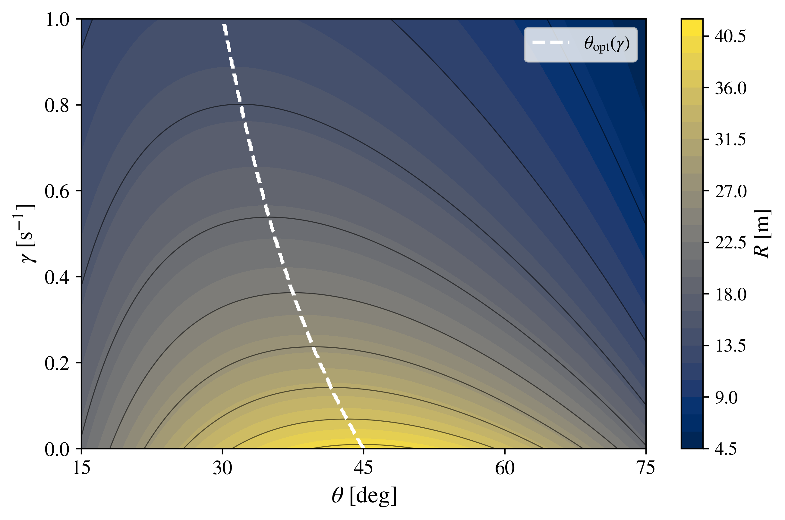

# Projectile Motion in Python

## Projectile Motion with Linear Air Resistance

The linear-drag projectile model extends the ideal description by including an aerodynamic force proportional to the instantaneous velocity of the projectile.

Although this model remains analytically solvable, the presence of air resistance modifies both the horizontal and vertical motion and produces trajectories that are no longer parabolic. The mathematical structure is therefore more complex than in the ideal case, while still allowing an exact treatment.

This makes the linear-drag model a useful intermediate step between ideal projectile motion and the quadratic-drag model considered later in this repository.

It also provides an important connection between analytical and numerical methods. The exact solution can be used to validate the numerical integration before moving to a model for which numerical methods become the principal computational tool.

---

## 📖 1. Physical description

A projectile is launched from the origin with initial speed $v_0$ and launch angle $\theta$, measured with respect to the horizontal axis.

In addition to gravity, the projectile experiences a drag force proportional and opposite to its instantaneous velocity:

$$
\mathbf{F}_d=-b\mathbf{v},
$$

where $b$ is the linear drag coefficient and

$$
\mathbf{v}=v_x\hat{\mathbf{x}}+v_y\hat{\mathbf{y}}.
$$

It is convenient to introduce the parameter

$$
\boxed{\gamma=\frac{b}{m}},
$$

where $m$ is the projectile mass.

The parameter $\gamma$ has dimensions of inverse time,

$$
[\gamma]=\mathrm{s^{-1}},
$$

and characterizes the rate at which the projectile velocity is damped by the linear drag force.

The characteristic damping time is therefore

$$
\boxed{\tau_d=\frac{1}{\gamma}}.
$$

A small value of $\gamma$ corresponds to weak damping, whereas a larger value produces a faster reduction of the projectile velocity.

The following assumptions are considered:

- the projectile is treated as a point particle;
- gravitational acceleration is constant;
- the motion takes place close to Earth's surface;
- the drag force is proportional to the instantaneous velocity;
- the surrounding medium is stationary;
- wind and other aerodynamic effects are neglected;
- the initial position is

$$
x(0)=0,\qquad y(0)=0;
$$

- the initial velocity components are

$$
v_x(0)=v_0\cos(\theta),\qquad v_y(0)=v_0\sin(\theta).
$$

Under these assumptions, the forces acting on the projectile are gravity and linear air resistance.

---

## ⚙️ 2. Governing equations

According to Newton's second law,

$$
m\frac{d^2\mathbf{r}}{dt^2}=\mathbf{F},
$$

where

$$
\mathbf{r}(t)=x(t)\hat{\mathbf{x}}+y(t)\hat{\mathbf{y}}.
$$

The total force is

$$
\mathbf{F}=-mg\hat{\mathbf{y}}-b\mathbf{v}.
$$

Using

$$
\mathbf{v}=\frac{d\mathbf{r}}{dt},
$$

the equation of motion becomes

$$
m\frac{d^2\mathbf{r}}{dt^2}=-mg\hat{\mathbf{y}}-b\frac{d\mathbf{r}}{dt}.
$$

Dividing by the mass and introducing

$$
\gamma=\frac{b}{m},
$$

we obtain

$$
\boxed{\frac{d^2\mathbf{r}}{dt^2}=-g\hat{\mathbf{y}}-\gamma\frac{d\mathbf{r}}{dt}}.
$$

The horizontal and vertical equations are therefore

$$
\boxed{\frac{d^2x}{dt^2}=-\gamma\frac{dx}{dt}}
$$

and

$$
\boxed{\frac{d^2y}{dt^2}=-g-\gamma\frac{dy}{dt}}.
$$

Unlike the ideal model, the horizontal acceleration is no longer zero. The drag force continuously reduces the horizontal velocity.

The vertical motion is also modified because both gravity and drag contribute to the vertical acceleration.

---

## 📐 3. Analytical solution

### Horizontal motion

The horizontal equation is

$$
\frac{d^2x}{dt^2}=-\gamma\frac{dx}{dt}.
$$

Using

$$
v_x=\frac{dx}{dt},
$$

we obtain

$$
\frac{dv_x}{dt}=-\gamma v_x.
$$

Separating variables gives

$$
\frac{dv_x}{v_x}=-\gamma\,dt.
$$

Integrating,

$$
\ln|v_x|=-\gamma t+C_1.
$$

Exponentiating gives

$$
v_x(t)=C_2e^{-\gamma t}.
$$

The initial condition

$$
v_x(0)=v_0\cos(\theta)
$$

implies

$$
C_2=v_0\cos(\theta).
$$

Therefore,

$$
\boxed{v_x(t)=v_0\cos(\theta)e^{-\gamma t}}.
$$

The horizontal velocity decreases exponentially with time.

In contrast with the ideal model,

$$
v_x(t)\neq\text{constant}
$$

when $\gamma>0$.

Since

$$
\frac{dx}{dt}=v_0\cos(\theta)e^{-\gamma t},
$$

integration from $0$ to $t$ gives

$$
x(t)=v_0\cos(\theta)\int_0^t e^{-\gamma t'}dt'.
$$

Using

$$
\int_0^t e^{-\gamma t'}dt'=\frac{1-e^{-\gamma t}}{\gamma},
$$

we obtain

$$
\boxed{x(t)=\frac{v_0\cos(\theta)}{\gamma}\left(1-e^{-\gamma t}\right)}.
$$

An interesting consequence follows from the long-time limit:

$$
\lim_{t\rightarrow\infty}x(t)=\frac{v_0\cos(\theta)}{\gamma}.
$$

Thus, in the linear-drag model, the horizontal displacement approaches a finite asymptotic value if the motion is mathematically continued indefinitely.

---

### Vertical motion

The vertical equation is

$$
\frac{d^2y}{dt^2}=-g-\gamma\frac{dy}{dt}.
$$

Using

$$
v_y=\frac{dy}{dt},
$$

we obtain

$$
\frac{dv_y}{dt}=-g-\gamma v_y.
$$

Rearranging,

$$
\frac{dv_y}{dt}+\gamma v_y=-g.
$$

This is a first-order linear differential equation.

The integrating factor is

$$
\mu(t)=e^{\gamma t}.
$$

Multiplying the equation by the integrating factor gives

$$
e^{\gamma t}\frac{dv_y}{dt}+\gamma e^{\gamma t}v_y=-ge^{\gamma t}.
$$

The left-hand side can be written as

$$
\frac{d}{dt}\left(e^{\gamma t}v_y\right)=-ge^{\gamma t}.
$$

Integrating,

$$
e^{\gamma t}v_y=-\frac{g}{\gamma}e^{\gamma t}+C_3.
$$

Therefore,

$$
v_y(t)=-\frac{g}{\gamma}+C_3e^{-\gamma t}.
$$

Using

$$
v_y(0)=v_0\sin(\theta),
$$

we obtain

$$
C_3=v_0\sin(\theta)+\frac{g}{\gamma}.
$$

Thus,

$$
\boxed{v_y(t)=\left(v_0\sin(\theta)+\frac{g}{\gamma}\right)e^{-\gamma t}-\frac{g}{\gamma}}.
$$

During the ascending part of the motion, the vertical velocity decreases until it becomes zero at the maximum height.

During the descending part, $v_y$ becomes negative.

If the downward motion were allowed to continue indefinitely,

$$
\lim_{t\rightarrow\infty}v_y(t)=-\frac{g}{\gamma}.
$$

Therefore, the linear-drag model predicts the terminal vertical velocity

$$
\boxed{v_{\mathrm{term}}=-\frac{g}{\gamma}}.
$$

To obtain the vertical position, we integrate

$$
\frac{dy}{dt}=\left(v_0\sin(\theta)+\frac{g}{\gamma}\right)e^{-\gamma t}-\frac{g}{\gamma}.
$$

Thus,

$$
y(t)=\left(v_0\sin(\theta)+\frac{g}{\gamma}\right)\int_0^t e^{-\gamma t'}dt'-\frac{g}{\gamma}\int_0^t dt'.
$$

Using

$$
\int_0^t e^{-\gamma t'}dt'=\frac{1-e^{-\gamma t}}{\gamma},
$$

we obtain

$$
\boxed{y(t)=\frac{1}{\gamma}\left(v_0\sin(\theta)+\frac{g}{\gamma}\right)\left(1-e^{-\gamma t}\right)-\frac{g}{\gamma}t}.
$$

---

### Parametric solution

The complete exact trajectory is therefore

$$
\boxed{x(t)=\frac{v_0\cos(\theta)}{\gamma}\left(1-e^{-\gamma t}\right)}
$$

and

$$
\boxed{y(t)=\frac{1}{\gamma}\left(v_0\sin(\theta)+\frac{g}{\gamma}\right)\left(1-e^{-\gamma t}\right)-\frac{g}{\gamma}t}.
$$

These equations provide an exact parametric description of projectile motion under linear air resistance.

The exponential dependence introduced by the drag force distinguishes this trajectory from the ideal parabolic motion.

---

### Cartesian trajectory $y(x)$

The time parameter can also be eliminated.

Starting from

$$
x(t)=\frac{v_0\cos(\theta)}{\gamma}\left(1-e^{-\gamma t}\right),
$$

we obtain

$$
\frac{\gamma x}{v_0\cos(\theta)}=1-e^{-\gamma t}.
$$

Therefore,

$$
e^{-\gamma t}=1-\frac{\gamma x}{v_0\cos(\theta)}.
$$

Taking the natural logarithm gives

$$
-\gamma t=\ln\left(1-\frac{\gamma x}{v_0\cos(\theta)}\right).
$$

Thus,

$$
t=-\frac{1}{\gamma}\ln\left(1-\frac{\gamma x}{v_0\cos(\theta)}\right).
$$

Substituting this expression into $y(t)$ and using

$$
1-e^{-\gamma t}=\frac{\gamma x}{v_0\cos(\theta)},
$$

we obtain

$$
y(x)=\left(v_0\sin(\theta)+\frac{g}{\gamma}\right)\frac{x}{v_0\cos(\theta)}+\frac{g}{\gamma^2}\ln\left(1-\frac{\gamma x}{v_0\cos(\theta)}\right).
$$

Therefore,

$$
\boxed{y(x)=x\tan(\theta)+\frac{gx}{\gamma v_0\cos(\theta)}+\frac{g}{\gamma^2}\ln\left(1-\frac{\gamma x}{v_0\cos(\theta)}\right)}.
$$

Unlike the ideal expression, this equation contains a logarithmic term and is not quadratic in $x$.

Consequently,

$$
\boxed{\text{the linear-drag trajectory is not a parabola}}.
$$

The exact parametric representation is used in the computational implementation because it provides a convenient and direct description of the complete trajectory.

---

### Time to maximum height

The maximum height occurs when

$$
v_y(t_H)=0.
$$

Using

$$
v_y(t)=\left(v_0\sin(\theta)+\frac{g}{\gamma}\right)e^{-\gamma t}-\frac{g}{\gamma},
$$

we obtain

$$
\left(v_0\sin(\theta)+\frac{g}{\gamma}\right)e^{-\gamma t_H}=\frac{g}{\gamma}.
$$

Therefore,

$$
e^{-\gamma t_H}=\frac{g}{g+\gamma v_0\sin(\theta)}.
$$

Taking the natural logarithm gives

$$
\boxed{t_H=\frac{1}{\gamma}\ln\left(1+\frac{\gamma v_0\sin(\theta)}{g}\right)}.
$$

It is useful to introduce the dimensionless quantity

$$
q=1+\frac{\gamma v_0\sin(\theta)}{g}.
$$

Then

$$
t_H=\frac{\ln(q)}{\gamma}.
$$

The maximum height is obtained from

$$
H_{\max}=y(t_H).
$$

Since

$$
e^{-\gamma t_H}=\frac{1}{q},
$$

substitution into the exact vertical position gives

$$
H_{\max}=\frac{v_0\sin(\theta)}{\gamma}-\frac{g}{\gamma^2}\ln(q).
$$

Therefore,

$$
\boxed{H_{\max}=\frac{v_0\sin(\theta)}{\gamma}-\frac{g}{\gamma^2}\ln\left(1+\frac{\gamma v_0\sin(\theta)}{g}\right)}.
$$

Compared with the ideal model, air resistance reduces the maximum height because part of the initial kinetic energy is continuously dissipated by the drag force.

---

### Flight time

The total flight time $T$ is determined by

$$
y(T)=0.
$$

Using the exact vertical position,

$$
\frac{1}{\gamma}\left(v_0\sin(\theta)+\frac{g}{\gamma}\right)\left(1-e^{-\gamma T}\right)-\frac{g}{\gamma}T=0.
$$

Multiplying by $\gamma$ gives

$$
\left(v_0\sin(\theta)+\frac{g}{\gamma}\right)\left(1-e^{-\gamma T}\right)-gT=0.
$$

Therefore,

$$
\boxed{\left(v_0\sin(\theta)+\frac{g}{\gamma}\right)\left(1-e^{-\gamma T}\right)-gT=0}.
$$

Unlike the ideal model, the flight time appears both linearly and inside an exponential function.

The equation is therefore transcendental.

However, it can be expressed exactly in terms of the Lambert $W$ function.

Define

$$
q=1+\frac{\gamma v_0\sin(\theta)}{g}
$$

and

$$
\tau=\gamma T.
$$

The flight-time equation becomes

$$
q\left(1-e^{-\tau}\right)=\tau.
$$

Rearranging,

$$
q-\tau=qe^{-\tau}.
$$

Define

$$
u=q-\tau.
$$

Since

$$
\tau=q-u,
$$

we obtain

$$
u=qe^{-(q-u)}.
$$

Therefore,

$$
u=qe^{-q}e^u.
$$

Multiplying by $e^{-u}$ gives

$$
ue^{-u}=qe^{-q}.
$$

Multiplying both sides by $-1$,

$$
(-u)e^{-u}=-qe^{-q}.
$$

By definition of the Lambert $W$ function,

$$
W(z)e^{W(z)}=z.
$$

Therefore,

$$
-u=W\left(-qe^{-q}\right).
$$

Since

$$
\tau=q-u,
$$

we obtain

$$
\tau=q+W\left(-qe^{-q}\right).
$$

For $q>1$, the branch $W_{-1}$ gives the trivial solution $T=0$, whereas the principal branch $W_0$ gives the nonzero physical flight time.

Thus,

$$
\boxed{T=\frac{1}{\gamma}\left[q+W_0\left(-qe^{-q}\right)\right]},
$$

where

$$
\boxed{q=1+\frac{\gamma v_0\sin(\theta)}{g}}.
$$

This result illustrates an important increase in mathematical complexity relative to the ideal model.

The flight time still possesses an exact analytical representation, but it is no longer expressible using only elementary functions.

In the Python trajectory programs included in this repository, the equivalent transcendental equation is solved numerically using a root-finding algorithm. This avoids requiring a special-function implementation while preserving the exact analytical trajectory.

---

### Horizontal range

Once the physical flight time has been determined, the horizontal range follows from

$$
R=x(T).
$$

Therefore,

$$
\boxed{R=\frac{v_0\cos(\theta)}{\gamma}\left(1-e^{-\gamma T}\right)}.
$$

Using the exact Lambert $W$ expression for $T$, the range can also be regarded as an exact analytical quantity.

However, unlike the ideal expression

$$
R_{\mathrm{ideal}}=\frac{v_0^2}{g}\sin(2\theta),
$$

the angular dependence is no longer described by the simple factor $\sin(2\theta)$.

Consequently, the complementary-angle symmetry

$$
R(\theta)=R(90^\circ-\theta)
$$

of the ideal model is generally lost.

Furthermore, the angle that maximizes the horizontal range is no longer universally fixed at

$$
45^\circ.
$$

Instead,

$$
\boxed{\theta_{\mathrm{opt}}=\theta_{\mathrm{opt}}(\gamma)}
$$

for fixed $v_0$.

This dependence is explored computationally in the horizontal-range map presented below.

---

### Ideal limit: $\gamma\rightarrow0$

An essential consistency requirement is that the linear-drag model must recover ideal projectile motion when the drag becomes negligible.

At first sight, the limit appears singular because the analytical expressions contain factors proportional to $1/\gamma$ and $1/\gamma^2$.

Therefore, $\gamma=0$ should not be substituted directly into these formulas.

Instead, the limit must be evaluated.

For small $\gamma$,

$$
e^{-\gamma t}=1-\gamma t+\frac{\gamma^2t^2}{2}-\frac{\gamma^3t^3}{6}+\mathcal{O}(\gamma^4).
$$

Therefore,

$$
1-e^{-\gamma t}=\gamma t-\frac{\gamma^2t^2}{2}+\frac{\gamma^3t^3}{6}+\mathcal{O}(\gamma^4).
$$

#### Horizontal velocity

From

$$
v_x(t)=v_0\cos(\theta)e^{-\gamma t},
$$

we immediately obtain

$$
\boxed{\lim_{\gamma\rightarrow0}v_x(t)=v_0\cos(\theta)}.
$$

This is the constant horizontal velocity of the ideal model.

#### Horizontal coordinate

Starting from

$$
x(t)=\frac{v_0\cos(\theta)}{\gamma}\left(1-e^{-\gamma t}\right),
$$

we substitute the expansion:

$$
x(t)=\frac{v_0\cos(\theta)}{\gamma}\left(\gamma t-\frac{\gamma^2t^2}{2}+\mathcal{O}(\gamma^3)\right).
$$

Thus,

$$
x(t)=v_0\cos(\theta)\left(t-\frac{\gamma t^2}{2}+\mathcal{O}(\gamma^2)\right).
$$

Therefore,

$$
\boxed{\lim_{\gamma\rightarrow0}x(t)=v_0\cos(\theta)t}.
$$

#### Vertical velocity

Starting from

$$
v_y(t)=\left(v_0\sin(\theta)+\frac{g}{\gamma}\right)e^{-\gamma t}-\frac{g}{\gamma},
$$

and expanding the exponential gives

$$
v_y(t)=\left(v_0\sin(\theta)+\frac{g}{\gamma}\right)\left(1-\gamma t+\mathcal{O}(\gamma^2)\right)-\frac{g}{\gamma}.
$$

The divergent terms cancel, leaving

$$
v_y(t)=v_0\sin(\theta)-gt+\mathcal{O}(\gamma).
$$

Hence,

$$
\boxed{\lim_{\gamma\rightarrow0}v_y(t)=v_0\sin(\theta)-gt}.
$$

#### Vertical coordinate

For the vertical coordinate,

$$
y(t)=\frac{1}{\gamma}\left(v_0\sin(\theta)+\frac{g}{\gamma}\right)\left(1-e^{-\gamma t}\right)-\frac{g}{\gamma}t.
$$

Substituting the expansion gives

$$
y(t)=\left(v_0\sin(\theta)+\frac{g}{\gamma}\right)\left(t-\frac{\gamma t^2}{2}+\frac{\gamma^2t^3}{6}+\mathcal{O}(\gamma^3)\right)-\frac{g}{\gamma}t.
$$

Expanding the leading terms,

$$
y(t)=v_0\sin(\theta)t-\frac{\gamma v_0\sin(\theta)t^2}{2}+\frac{g}{\gamma}t-\frac{gt^2}{2}+\mathcal{O}(\gamma)-\frac{g}{\gamma}t.
$$

The apparently divergent terms cancel exactly.

Therefore,

$$
\boxed{\lim_{\gamma\rightarrow0}y(t)=v_0\sin(\theta)t-\frac{1}{2}gt^2}.
$$

The complete ideal trajectory is consequently recovered:

$$
\boxed{\text{Linear-drag model}\xrightarrow{\gamma\rightarrow0}\text{Ideal projectile model}}.
$$

The flight time and range also recover their ideal values:

$$
\boxed{\lim_{\gamma\rightarrow0}T=\frac{2v_0\sin(\theta)}{g}}
$$

and

$$
\boxed{\lim_{\gamma\rightarrow0}R=\frac{v_0^2}{g}\sin(2\theta)}.
$$

This limiting behavior provides an important mathematical and physical consistency check.

In the numerical programs, the case $\gamma=0$ is evaluated directly using the ideal equations to avoid division by zero in the linear-drag formulas.

---

## 💻 4. Numerical implementation

For numerical integration, the second-order equations are rewritten as four first-order equations.

Defining

$$
v_x=\frac{dx}{dt},\qquad v_y=\frac{dy}{dt},
$$

we obtain

$$
\frac{dx}{dt}=v_x,
$$

$$
\frac{dy}{dt}=v_y,
$$

$$
\frac{dv_x}{dt}=-\gamma v_x,
$$

and

$$
\frac{dv_y}{dt}=-g-\gamma v_y.
$$

The state vector is

$$
\mathbf{u}(t)=
\begin{pmatrix}
x(t)\\
y(t)\\
v_x(t)\\
v_y(t)
\end{pmatrix}.
$$

The initial condition is

$$
\mathbf{u}(0)=
\begin{pmatrix}
0\\
0\\
v_0\cos(\theta)\\
v_0\sin(\theta)
\end{pmatrix}.
$$

The equations are integrated using SciPy's `solve_ivp` routine.

A ground-impact event stops the integration when the projectile crosses

$$
y=0
$$

during its descending motion.

Because an exact analytical solution exists, the numerical trajectories can be directly compared with the analytical results.

In the trajectory figures:

- continuous curves represent the analytical solution;
- circular markers represent the numerical integration.

Their agreement validates the computational implementation.

This role is especially important in the progression developed in this repository: numerical integration first reproduces a model with a known exact solution before being applied to the quadratic-drag model.

---

## 🐍 5. Python codes

Four Python programs are included for the linear-drag model.

| Program | Description |
|:---|:---|
| `linear_angle_variation.py` | Compares analytical and numerical trajectories for different launch angles. |
| `linear_velocity_variation.py` | Compares analytical and numerical trajectories for different initial speeds. |
| `linear_gamma_variation.py` | Compares analytical and numerical trajectories for different values of the linear-drag parameter $\gamma$, including the ideal limit $\gamma=0$. |
| `linear_range_map.py` | Evaluates the horizontal range $R(\theta,\gamma)$ for fixed $v_0$ and determines the optimal launch angle $\theta_{\mathrm{opt}}(\gamma)$. |

The first three programs emphasize the agreement between the exact analytical solution and the independent numerical integration.

The fourth program explores the range over a two-dimensional parameter space and provides a global view of how linear air resistance modifies both the achievable range and the optimal launch angle.

---

## 📈 6. Generated figures

The figures below illustrate the principal physical consequences of introducing linear air resistance.

The first three figures compare analytical and numerical trajectories, while the fourth explores the dependence of the horizontal range on both the launch angle and the drag parameter.

---

### Figure 1. Variation of the launch angle

The initial speed and drag parameter are kept fixed at

$$
v_0=20\ \mathrm{m/s}
$$

and

$$
\gamma=0.2\ \mathrm{s^{-1}},
$$

while the launch angle is varied.

The values considered are

$$
\theta=15^\circ,\ 30^\circ,\ 45^\circ,\ 60^\circ,\ 75^\circ.
$$

Continuous curves represent the exact analytical solution, whereas circular markers correspond to the numerical integration.

The numerical markers overlap the analytical trajectories, confirming the consistency of the numerical implementation.

As in the ideal model, increasing the launch angle initially increases the flight time and produces higher trajectories.

However, the presence of drag changes the horizontal motion substantially because the horizontal velocity decreases according to

$$
v_x(t)=v_0\cos(\theta)e^{-\gamma t}.
$$

The complementary-angle symmetry of the ideal model is therefore lost.

In particular,

$$
R(\theta)\neq R(90^\circ-\theta)
$$

in general when $\gamma>0$.

The angle that maximizes the horizontal range is also shifted away from the universal ideal value of $45^\circ$.

This shift becomes clearer in the two-dimensional range map presented in Figure 4.

High-resolution PDF:

[Download PDF](linear_angle_variation.pdf)

---

### Figure 2. Variation of the initial speed

The launch angle and drag parameter are fixed at

$$
\theta=45^\circ
$$

and

$$
\gamma=0.2\ \mathrm{s^{-1}},
$$

while the initial speed is varied.

The values considered are

$$
v_0=10,\ 15,\ 20,\ 25,\ 30\ \mathrm{m/s}.
$$

Continuous curves represent the analytical solution and circular markers represent the numerical integration.

Increasing $v_0$ increases both the horizontal range and the maximum height.

However, the dependence is no longer described by the simple ideal scaling

$$
R\propto v_0^2
$$

over the complete parameter range, because increasing the speed also increases the magnitude of the linear drag force,

$$
|\mathbf{F}_d|=b|\mathbf{v}|.
$$

Thus, a larger launch speed simultaneously provides greater initial kinetic energy and produces a larger instantaneous drag force.

The resulting competition modifies the simple quadratic scaling found in the ideal model.

The numerical markers again reproduce the analytical trajectories over the complete motion.

High-resolution PDF:

[Download PDF](linear_velocity_variation.pdf)

---

### Figure 3. Variation of the linear-drag parameter

The initial speed and launch angle are fixed at

$$
v_0=20\ \mathrm{m/s}
$$

and

$$
\theta=45^\circ,
$$

while the linear-drag parameter is varied.

The values considered are

$$
\gamma=0,\ 0.1,\ 0.2,\ 0.5,\ 1.0\ \mathrm{s^{-1}}.
$$

The case

$$
\gamma=0
$$

corresponds to the ideal projectile limit.

As $\gamma$ increases, the damping time

$$
\tau_d=\frac{1}{\gamma}
$$

decreases.

Consequently, the projectile loses horizontal velocity more rapidly and the horizontal range is progressively reduced.

The maximum height is also reduced because the drag force opposes the upward motion during ascent.

The trajectories therefore become both shorter and lower as the strength of the linear resistance increases.

The $\gamma=0$ trajectory coincides with the ideal projectile result, providing a direct visual representation of the limit

$$
\gamma\rightarrow0.
$$

For every nonzero value of $\gamma$, the continuous analytical trajectory and the numerical markers remain in agreement.

High-resolution PDF:

[Download PDF](linear_gamma_variation.pdf)

---

### Figure 4. Horizontal-range map $R(\theta,\gamma)$

To explore the combined influence of launch angle and linear air resistance, the horizontal range is evaluated over the parameter space

$$
R=R(\theta,\gamma)
$$

with the initial speed fixed at

$$
v_0=20\ \mathrm{m/s}.
$$

The ranges considered are

$$
15^\circ\leq\theta\leq75^\circ
$$

and

$$
0\leq\gamma\leq1.0\ \mathrm{s^{-1}}.
$$

The color scale represents the horizontal range $R$, while the contour lines identify regions of equal range.

The dashed curve represents the optimal launch angle

$$
\theta_{\mathrm{opt}}(\gamma)
$$

obtained by maximizing the horizontal range with respect to $\theta$ for each value of $\gamma$.

At

$$
\gamma=0,
$$

the ideal model is recovered and the optimal angle is

$$
\theta_{\mathrm{opt}}=45^\circ.
$$

As $\gamma$ increases, two effects become visible simultaneously.

First, the horizontal range decreases because stronger drag removes horizontal momentum more rapidly.

Second, the angle that maximizes the range shifts below the ideal value:

$$
\theta_{\mathrm{opt}}(\gamma)<45^\circ
$$

for $\gamma>0$.

The physical reason is that, in the presence of drag, spending additional time in flight is no longer always advantageous. A high-angle trajectory remains airborne longer, but the projectile is also exposed to the dissipative force for a longer time.

A lower launch angle allocates a larger fraction of the initial velocity to horizontal motion and reduces the time during which drag acts before impact.

The optimal trajectory therefore results from a competition between vertical flight time and horizontal velocity retention.

This behavior contrasts directly with the ideal model, where the optimal-angle line remains fixed at

$$
\theta_{\mathrm{opt}}=45^\circ
$$

for every value of $v_0$.

The range map consequently summarizes two important consequences of linear air resistance in a single representation:

1. the progressive reduction of the horizontal range;
2. the displacement of the optimal launch angle away from $45^\circ$.

This map will later provide a direct point of comparison with the corresponding quadratic-drag result.

High-resolution PDF:

[Download PDF](linear_range_map.pdf)

---

## 📚 7. References

Classical mechanics, projectile-motion, linear-drag, special-function, computational-physics, and numerical-method references will be incorporated after the theoretical development of the associated manuscript is finalized.
