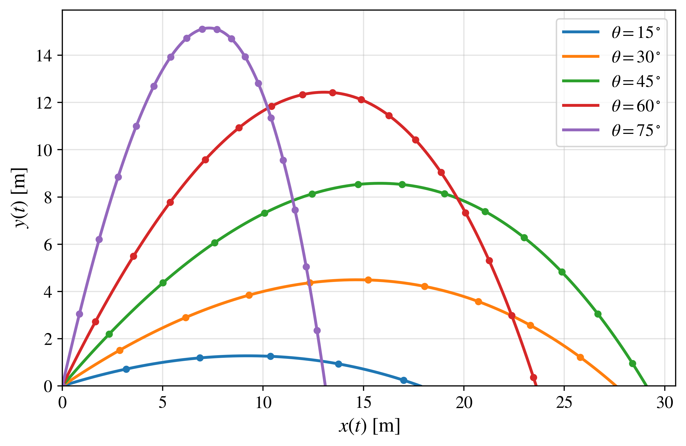
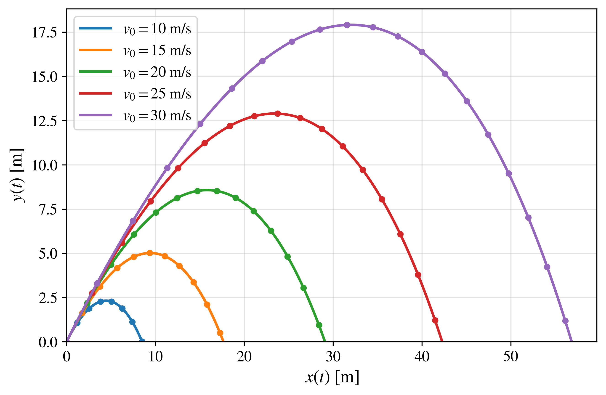
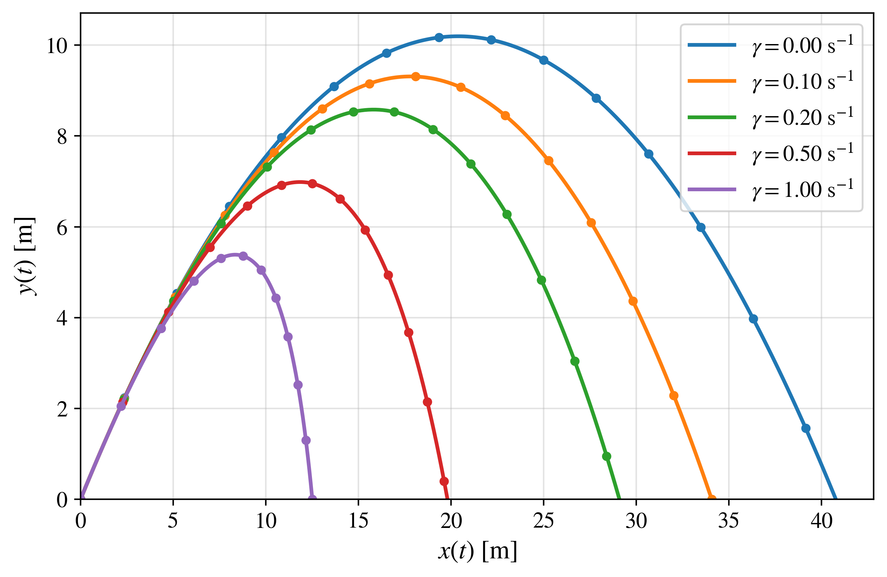

# Projectile Motion in Python

## Projectile Motion with Linear Air Resistance

The linear-drag projectile model extends the ideal description by including an aerodynamic force proportional to the instantaneous velocity of the projectile.

Although this model remains analytically solvable, the presence of air resistance modifies both the horizontal and vertical motion and produces trajectories that are no longer parabolic. This makes the linear-drag model a useful intermediate step between ideal projectile motion and the more realistic quadratic-drag model.

It also provides an important connection between analytical and numerical methods: the exact solution can be used to validate the numerical integration before moving to a model for which numerical methods become essential.

---

## 📖 1. Physical description

A projectile is launched from the origin with initial speed $v_0$ and launch angle $\theta$, measured with respect to the horizontal axis.

In addition to gravity, the projectile experiences a drag force proportional and opposite to its instantaneous velocity:

$$
\mathbf{F}_d=-b\mathbf{v},
$$

where $b$ is the linear drag coefficient and

$$
\mathbf{v}=v_x\hat{\mathbf{x}}+v_y\hat{\mathbf{y}}.
$$

It is convenient to introduce the parameter

$$
\boxed{\gamma=\frac{b}{m}},
$$

where $m$ is the projectile mass.

The parameter $\gamma$ has units of inverse time,

$$
[\gamma]=\mathrm{s^{-1}},
$$

and characterizes the rate at which the velocity is damped by the linear drag force.

The following assumptions are considered:

- the projectile is treated as a point particle;
- gravitational acceleration is constant;
- the motion takes place close to Earth's surface;
- the drag force is proportional to the instantaneous velocity;
- wind and other aerodynamic effects are neglected;
- the initial position is

$$
x(0)=0,\qquad y(0)=0;
$$

- the initial velocity components are

$$
v_x(0)=v_0\cos(\theta),\qquad v_y(0)=v_0\sin(\theta).
$$

Under these assumptions, the forces acting on the projectile are gravity and linear air resistance.

---

## ⚙️ 2. Governing equations

According to Newton's second law,

$$
m\frac{d^2\mathbf{r}}{dt^2}=\mathbf{F},
$$

where

$$
\mathbf{r}(t)=x(t)\hat{\mathbf{x}}+y(t)\hat{\mathbf{y}}.
$$

The total force is

$$
\mathbf{F}=-mg\hat{\mathbf{y}}-b\mathbf{v}.
$$

Using

$$
\mathbf{v}=\frac{d\mathbf{r}}{dt},
$$

the equation of motion becomes

$$
m\frac{d^2\mathbf{r}}{dt^2}
= -mg\hat{\mathbf{y}}
-b\frac{d\mathbf{r}}{dt}.
$$

Dividing by the mass and using

$$
\gamma=\frac{b}{m},
$$

we obtain

$$
\boxed{
\frac{d^2\mathbf{r}}{dt^2}
= -g\hat{\mathbf{y}}
-\gamma\frac{d\mathbf{r}}{dt}
}.
$$

The horizontal and vertical equations are therefore

$$
\boxed{
\frac{d^2x}{dt^2}
= -\gamma\frac{dx}{dt}
}
$$

and

$$
\boxed{
\frac{d^2y}{dt^2}
= -g-\gamma\frac{dy}{dt}
}.
$$

Unlike the ideal model, both velocity components now change with time because of the drag force.

---

## 📐 3. Analytical solution

### Horizontal motion

The horizontal equation is

$$
\frac{d^2x}{dt^2}
= -\gamma\frac{dx}{dt}.
$$

Using

$$
v_x=\frac{dx}{dt},
$$

we obtain the first-order equation

$$
\frac{dv_x}{dt}=-\gamma v_x.
$$

Separating variables gives

$$
\frac{dv_x}{v_x}=-\gamma dt.
$$

Integrating both sides,

$$
\ln|v_x|=-\gamma t+C_1.
$$

Exponentiating,

$$
v_x(t)=C_2e^{-\gamma t}.
$$

The initial condition

$$
v_x(0)=v_0\cos(\theta)
$$

gives

$$
C_2=v_0\cos(\theta).
$$

Therefore,

$$
\boxed{
v_x(t)=v_0\cos(\theta)e^{-\gamma t}
}.
$$

Unlike the ideal model, the horizontal velocity is no longer constant. It decreases exponentially because of the linear drag force.

Since

$$
\frac{dx}{dt}=v_0\cos(\theta)e^{-\gamma t},
$$

we integrate from the initial position to the position at time $t$:

$$
\int_0^{x(t)}dx
= v_0\cos(\theta)
\int_0^t e^{-\gamma t'}dt'.
$$

The integral is

$$
\int_0^t e^{-\gamma t'}dt'
= \frac{1-e^{-\gamma t}}{\gamma}.
$$

Therefore,

$$
\boxed{
x(t)=
\frac{v_0\cos(\theta)}{\gamma}
\left(1-e^{-\gamma t}\right)
}.
$$

---

### Vertical motion

The vertical equation is

$$
\frac{d^2y}{dt^2}
= -g-\gamma\frac{dy}{dt}.
$$

Using

$$
v_y=\frac{dy}{dt},
$$

we obtain

$$
\frac{dv_y}{dt}=-g-\gamma v_y.
$$

Rearranging,

$$
\frac{dv_y}{dt}+\gamma v_y=-g.
$$

This is a first-order linear differential equation.

The integrating factor is

$$
\mu(t)=e^{\gamma t}.
$$

Multiplying the differential equation by the integrating factor gives

$$
e^{\gamma t}\frac{dv_y}{dt}
+\gamma e^{\gamma t}v_y
= - ge^{\gamma t}.
$$

The left-hand side can be written as

$$
\frac{d}{dt}
\left(
e^{\gamma t}v_y
\right)
= -ge^{\gamma t}.
$$

Integrating,

$$
e^{\gamma t}v_y
= -\frac{g}{\gamma}e^{\gamma t}
+C_3.
$$

Therefore,

$$
v_y(t)
= -\frac{g}{\gamma}
+
C_3e^{-\gamma t}.
$$

Using the initial condition

$$
v_y(0)=v_0\sin(\theta),
$$

we obtain

$$
v_0\sin(\theta)
= -\frac{g}{\gamma}+C_3.
$$

Thus,

$$
C_3=
v_0\sin(\theta)+\frac{g}{\gamma}.
$$

The vertical velocity is therefore

$$
\boxed{
v_y(t)
= \left(
v_0\sin(\theta)+\frac{g}{\gamma}
\right)e^{-\gamma t}
-\frac{g}{\gamma}
}.
$$

The vertical velocity decreases during the ascending part of the motion, becomes zero at the maximum height, and subsequently becomes negative during the descent.

Since

$$
\frac{dy}{dt}
= \left(
v_0\sin(\theta)+\frac{g}{\gamma}
\right)e^{-\gamma t}
-\frac{g}{\gamma},
$$

integrating from $0$ to $t$ gives

$$
y(t)
=\left(
v_0\sin(\theta)+\frac{g}{\gamma}
\right)
\int_0^t e^{-\gamma t'}dt'
-\frac{g}{\gamma}\int_0^t dt'.
$$

Therefore,

$$
\boxed{
y(t) =
\frac{1}{\gamma}
\left(
v_0\sin(\theta)+\frac{g}{\gamma}
\right)
\left(1-e^{-\gamma t}\right)
-\frac{g}{\gamma}t
}.
$$

---

### Parametric solution

The complete analytical trajectory is therefore described by

$$
\boxed{
x(t)=
\frac{v_0\cos(\theta)}{\gamma}
\left(1-e^{-\gamma t}\right)}
$$

and

$$
\boxed{
y(t)
=\frac{1}{\gamma}
\left(
v_0\sin(\theta)+\frac{g}{\gamma}
\right)
\left(1-e^{-\gamma t}\right)
-\frac{g}{\gamma}t}.
$$

These equations provide an exact parametric description of the projectile trajectory in the presence of linear air resistance.

Unlike the ideal model, the trajectory is no longer a parabola.

---

### Cartesian trajectory $y(x)$

The time parameter can also be eliminated to obtain an explicit Cartesian trajectory.

Starting from

$$
x(t)=
\frac{v_0\cos(\theta)}{\gamma}
\left(1-e^{-\gamma t}\right),
$$

we obtain

$$
\frac{\gamma x}{v_0\cos(\theta)}
=1-e^{-\gamma t}.
$$

Therefore,

$$
e^{-\gamma t}
=1-
\frac{\gamma x}{v_0\cos(\theta)}.
$$

Taking the natural logarithm,

$$
-\gamma t
=\ln
\left(
1-
\frac{\gamma x}{v_0\cos(\theta)}
\right).
$$

Thus,

$$
t=
-\frac{1}{\gamma}
\ln
\left(
1-
\frac{\gamma x}{v_0\cos(\theta)}
\right).
$$

Substituting this expression into $y(t)$ and using

$$
1-e^{-\gamma t}
= \frac{\gamma x}{v_0\cos(\theta)},
$$

we obtain

$$
y(x)
= \left(
v_0\sin(\theta)+\frac{g}{\gamma}
\right)
\frac{x}{v_0\cos(\theta)}
+\frac{g}{\gamma^2}
\ln
\left(
1-
\frac{\gamma x}{v_0\cos(\theta)}
\right).
$$

Therefore,

$$
\boxed{
y(x)
= x\tan(\theta)
+\frac{gx}{\gamma v_0\cos(\theta)}
+\frac{g}{\gamma^2}
\ln
\left(
1-
\frac{\gamma x}{v_0\cos(\theta)}
\right)
}.
$$

This expression is not quadratic in $x$. Consequently, the trajectory in the presence of linear air resistance is not a parabola.

For the computational implementation in this repository, the exact parametric expressions $x(t)$ and $y(t)$ are used directly because they provide a convenient representation of the complete trajectory.

---

### Time to maximum height

The maximum height is reached when

$$
v_y(t_H)=0.
$$

Using

$$
v_y(t)
= \left(
v_0\sin(\theta)+\frac{g}{\gamma}
\right)e^{-\gamma t}
-\frac{g}{\gamma},
$$

we obtain

$$
\left(
v_0\sin(\theta)+\frac{g}{\gamma}
\right)e^{-\gamma t_H}
= \frac{g}{\gamma}.
$$

Therefore,

$$
e^{-\gamma t_H}
= \frac{g}{g+\gamma v_0\sin(\theta)}.
$$

Taking the natural logarithm gives

$$
\boxed{
t_H=
\frac{1}{\gamma}
\ln
\left(
1+
\frac{\gamma v_0\sin(\theta)}{g}
\right)
}.
$$

The maximum height can then be obtained by evaluating the analytical vertical position at this time:

$$
H_{\max}=y(t_H).
$$

---

### Flight time

The total flight time $T$ is determined by the condition

$$
y(T)=0.
$$

Using the analytical solution,

$$
\frac{1}{\gamma}
\left(
v_0\sin(\theta)+\frac{g}{\gamma}
\right)
\left(1-e^{-\gamma T}\right)
-\frac{g}{\gamma}T
= 0.
$$

Multiplying by $\gamma$ gives

$$
\left(
v_0\sin(\theta)+\frac{g}{\gamma}
\right)
\left(1-e^{-\gamma T}\right)
-gT
= 0.
$$

Unlike the ideal projectile model, this equation contains the flight time both linearly and inside an exponential function.

Therefore, the nonzero flight time is determined from the transcendental equation

$$
\boxed{
\left(
v_0\sin(\theta)+\frac{g}{\gamma}
\right)
\left(1-e^{-\gamma T}\right)
-gT = 0 }.
$$

In the Python implementation, the nonzero root is obtained numerically using a root-finding method.

---

### Horizontal range

Once the flight time $T$ has been determined, the horizontal range follows directly from the analytical horizontal position:

$$
R=x(T).
$$

Therefore,

$$
\boxed{
R=
\frac{v_0\cos(\theta)}{\gamma}
\left(1-e^{-\gamma T}\right)
}.
$$

Unlike the ideal result

$$
R=\frac{v_0^2}{g}\sin(2\theta),
$$

the range in the linear-drag model depends implicitly on the flight time and therefore on the drag parameter $\gamma$.

Consequently, the symmetry between complementary launch angles found in the ideal model is generally lost when linear air resistance is introduced.

---

### Ideal limit: $\gamma\rightarrow0$

An important consistency check is that the linear-drag model must recover the ideal projectile model when the drag becomes negligible.

At first sight, this limit may appear problematic because the analytical solutions contain terms proportional to $1/\gamma$ and $1/\gamma^2$. Therefore, $\gamma=0$ cannot simply be substituted directly into these expressions.

Instead, the limit must be evaluated.

For small $\gamma$, the exponential can be expanded as

$$
e^{-\gamma t}
= 1-\gamma t+\frac{\gamma^2t^2}{2}
-\frac{\gamma^3t^3}{6}
+\cdots.
$$

Therefore,

$$
1-e^{-\gamma t}
= \gamma t-\frac{\gamma^2t^2}{2}
+\frac{\gamma^3t^3}{6}
+\cdots.
$$

#### Horizontal coordinate

Starting from

$$
x(t)=
\frac{v_0\cos(\theta)}{\gamma}
\left(1-e^{-\gamma t}\right),
$$

we substitute the expansion:

$$
x(t)
= \frac{v_0\cos(\theta)}{\gamma}
\left(
\gamma t-\frac{\gamma^2t^2}{2}
+\cdots
\right).
$$

Simplifying,

$$
x(t)
= v_0\cos(\theta)
\left(
t-\frac{\gamma t^2}{2}
+\cdots
\right).
$$

Thus,

$$
\boxed{
\lim_{\gamma\rightarrow0}x(t)
= v_0\cos(\theta)t
}.
$$

This is exactly the horizontal position of the ideal projectile model.

#### Vertical coordinate

For the vertical coordinate,

$$
y(t)
= \frac{1}{\gamma}
\left(
v_0\sin(\theta)+\frac{g}{\gamma}
\right)
\left(1-e^{-\gamma t}\right)
-\frac{g}{\gamma}t.
$$

Using the expansion,

$$
1-e^{-\gamma t}
= \gamma t-\frac{\gamma^2t^2}{2}
+\frac{\gamma^3t^3}{6}
+\cdots,
$$

we obtain

$$
y(t)
= \left(
v_0\sin(\theta)+\frac{g}{\gamma}
\right)
\left(
t-\frac{\gamma t^2}{2}
+\frac{\gamma^2t^3}{6}
+\cdots
\right)
-\frac{g}{\gamma}t.
$$

Expanding the terms gives

$$
y(t)
=v_0\sin(\theta)t
-\frac{\gamma v_0\sin(\theta)t^2}{2}
+\frac{g}{\gamma}t
-\frac{gt^2}{2}
+\cdots
-\frac{g}{\gamma}t.
$$

The apparently divergent terms cancel:

$$
\frac{g}{\gamma}t-\frac{g}{\gamma}t=0.
$$

Therefore, in the limit $\gamma\rightarrow0$,

$$
\boxed{
\lim_{\gamma\rightarrow0}y(t)
= v_0\sin(\theta)t-\frac{1}{2}gt^2
}.
$$

This is exactly the vertical position of the ideal projectile model.

Hence,

$$
\boxed{
\text{Linear-drag model}
\quad
\xrightarrow{\gamma\rightarrow0}
\quad
\text{Ideal projectile model}
}.
$$

This limiting behavior provides an important physical and mathematical consistency check of the analytical solution.

In the $\gamma$-variation figure included in this repository, the case $\gamma=0$ is evaluated separately using the ideal projectile equations, since direct substitution of $\gamma=0$ into the linear-drag expressions would lead to divisions by zero.

---

## 💻 4. Numerical implementation

For the numerical solution, the second-order equations are rewritten as a system of four first-order differential equations.

Defining

$$
v_x=\frac{dx}{dt},\qquad v_y=\frac{dy}{dt},
$$

the system becomes

$$
\frac{dx}{dt}=v_x,
$$

$$
\frac{dy}{dt}=v_y,
$$

$$
\frac{dv_x}{dt}=-\gamma v_x,
$$

and

$$
\frac{dv_y}{dt}=-g-\gamma v_y.
$$

The corresponding state vector is

$$
\mathbf{u}(t)=
\begin{pmatrix}
x(t)\\
y(t)\\
v_x(t)\\
v_y(t)
\end{pmatrix}.
$$

The numerical integration is performed using SciPy's `solve_ivp` function.

The integration begins with

$$
\mathbf{u}(0)=
\begin{pmatrix}
0\\
0\\
v_0\cos(\theta)\\
v_0\sin(\theta)
\end{pmatrix},
$$

and stops when the projectile returns to

$$
y=0
$$

during the descending part of the trajectory.

Because an exact analytical solution exists for the linear-drag model, the numerical integration can be directly compared with the analytical trajectory.

For the figures:

- continuous lines represent the analytical solution;
- circular markers represent the numerical solution.

The agreement between both approaches provides a direct validation of the numerical implementation.

This validation becomes particularly important when moving to the quadratic-drag model, where the equations of motion generally require numerical integration.

---

## 🐍 5. Python codes

The Python implementations compute both the analytical and numerical solutions of the linear-drag projectile model.

The exact parametric expressions

$$
x(t)=
\frac{v_0\cos(\theta)}{\gamma}
\left(1-e^{-\gamma t}\right)
$$

and

$$
y(t)
= \frac{1}{\gamma}
\left(
v_0 \sin(\theta)+\frac{g}{\gamma}
\right)
\left(1-e^{-\gamma t}\right)
-\frac{g}{\gamma}t
$$

are used to generate the continuous curves, whereas the governing differential equations are independently integrated using SciPy's `solve_ivp` function to generate the numerical markers.

| Program | Description |
|:---|:---|
| `linear_angle_variation.py` | Compares the analytical and numerical trajectories for different launch angles. |
| `linear_velocity_variation.py` | Compares the analytical and numerical trajectories for different initial speeds. |
| `linear_gamma_variation.py` | Compares the analytical and numerical trajectories for different values of the linear-drag parameter $\gamma$. |

---

## 📈 6. Generated figures

The Python programs generate the figures presented below, comparing the analytical solution (continuous curves) with the numerical integration (circular markers). The agreement between both approaches validates the numerical implementation of the linear-drag model.

### Figure 1. Variation of the launch angle

The launch angle is varied while the initial speed and the linear-drag parameter remain fixed.

The figure shows the projectile trajectories for different launch angles. Continuous curves correspond to the analytical solution, whereas circular markers represent the numerical integration of the governing differential equations.

High-resolution PDF:

[Download PDF](linear_angle_variation.pdf)

---

### Figure 2. Variation of the initial speed

The initial speed is varied while the launch angle and the linear-drag parameter remain fixed.

The figure shows the projectile trajectories for different initial speeds. Continuous curves correspond to the analytical solution, whereas circular markers represent the numerical integration of the governing differential equations.

High-resolution PDF:

[Download PDF](linear_velocity_variation.pdf)

---

### Figure 3. Variation of the linear-drag parameter

The linear-drag parameter is varied while the initial speed and launch angle remain fixed.

The values considered are

$$
\gamma=0,\;0.1,\;0.2,\;0.5,\;1.0\ \mathrm{s^{-1}}.
$$

The case $\gamma=0$ corresponds to the ideal projectile limit, whereas increasing values of $\gamma$ represent progressively stronger linear damping.

Continuous curves correspond to the analytical solution, whereas circular markers represent the numerical integration of the governing differential equations.

High-resolution PDF:

[Download PDF](linear_gamma_variation.pdf)

---

## 📚 7. References

Classical mechanics, projectile-motion, linear-drag, and numerical-method references will be incorporated after the theoretical section of the associated article is finalized.
