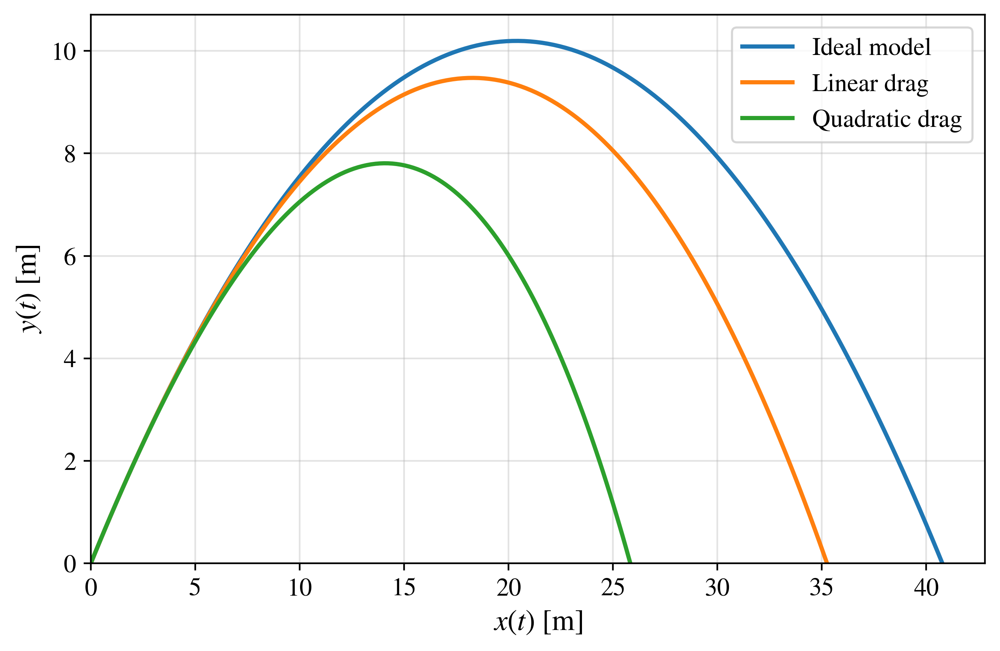

# Projectile Motion in Python

## Overview

This repository accompanies the article

> **A computational and pedagogical framework for projectile motion using Python visualizations.**

Its objective is to provide a reproducible computational framework for studying projectile motion using Python. The repository combines analytical derivations, numerical simulations, and graphical visualizations to facilitate the understanding of projectile dynamics under different physical assumptions.

Three projectile-motion models with increasing mathematical and computational complexity are considered throughout this repository.

---

## Projectile-motion models

| Model | Analytical solution | Numerical solution |
|:------|:-------------------:|:------------------:|
| Ideal projectile motion | ✅ | ✅ |
| Linear air resistance | ✅ | ✅ |
| Quadratic air resistance | ❌ | ✅ |

---

## Comparison of the three projectile-motion models

The following figure compares the trajectories predicted by the three projectile-motion models using identical initial conditions. It provides an overview of how air resistance progressively modifies the projectile trajectory.





The ideal model produces the well-known parabolic trajectory. The linear-drag model still admits an exact analytical solution, although the trajectory is no longer parabolic. In contrast, the quadratic-drag model generally does not possess a closed-form analytical solution and therefore requires numerical integration.

---

## Python program

| Program | Description |
|:--------|:------------|
| `three_models_comparison.py` | Generates the comparison figure of the three projectile-motion models using identical initial conditions. |

---

## How to run

Install the required Python packages

```bash
pip install -r ../requirements.txt
```

Then execute

```bash
python three_models_comparison.py
```

---

## High-resolution figure

The PDF version of the comparison figure can be downloaded here.

<!--
[Download PDF](three_models_comparison.pdf)
-->

---

## Repository organization

The remaining folders of the repository are organized according to the projectile-motion model being studied.

| Folder | Contents |
|:------|:---------|
| `ideal_model` | Ideal projectile motion. |
| `linear_drag` | Projectile motion with linear air resistance. |
| `quadratic_drag` | Projectile motion with quadratic air resistance. |

Each folder contains the theoretical formulation, documented Python implementations, numerical simulations, and the corresponding figures presented in the associated article.

---

## References

The references associated with this overview will be incorporated as the repository is completed.
