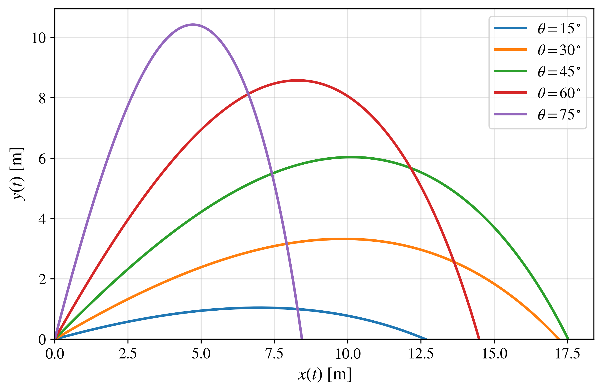
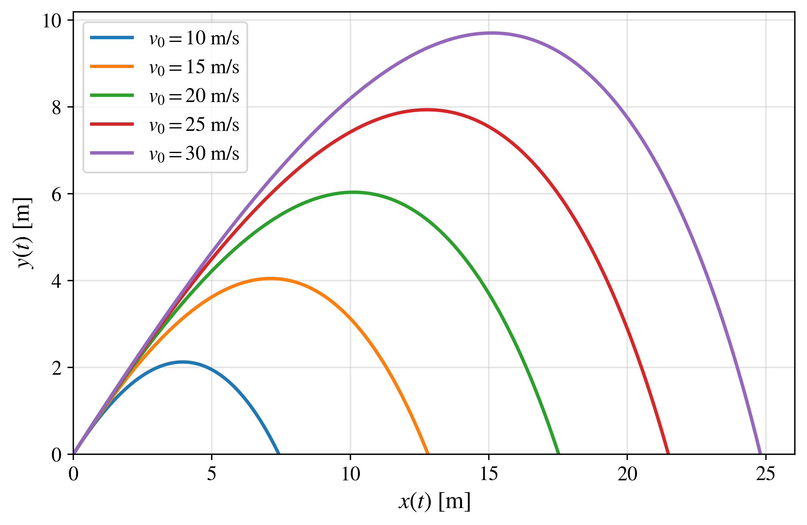
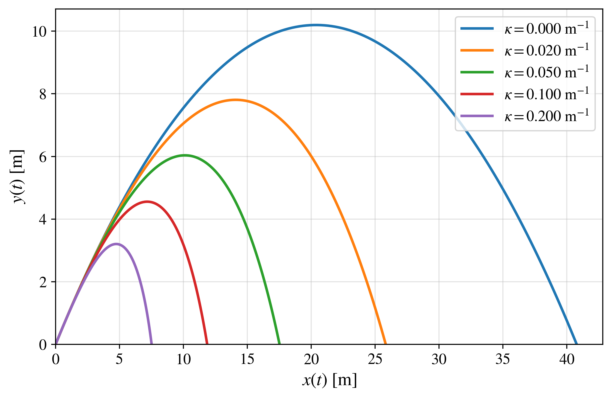
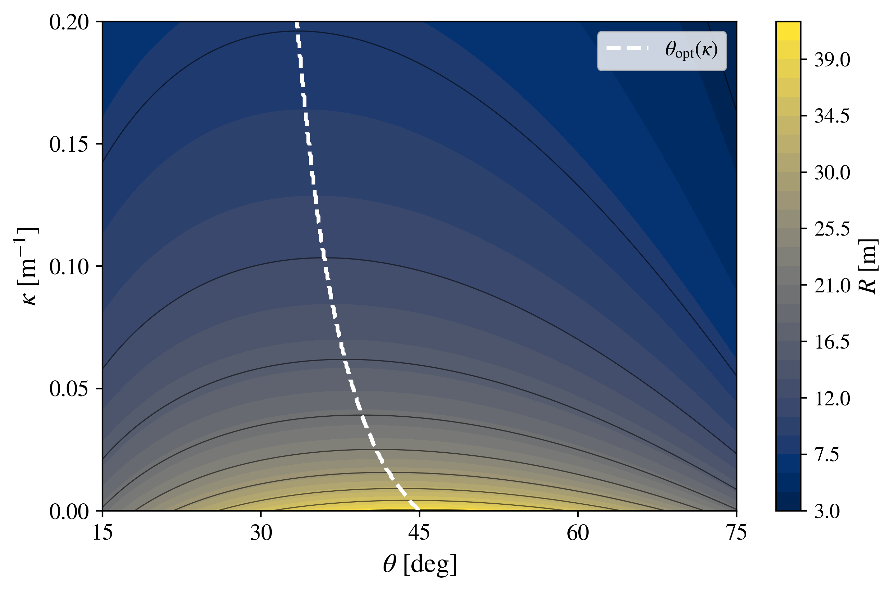

# Projectile Motion in Python

## Projectile Motion with Quadratic Air Resistance

The quadratic-drag projectile model extends the previous descriptions by introducing a resistance force whose magnitude is proportional to the square of the projectile speed.

This model represents an important increase in both physical realism and mathematical complexity. Unlike the ideal and linear-drag cases, the horizontal and vertical equations are coupled through the instantaneous speed of the projectile. As a consequence, the complete two-dimensional motion is governed by a nonlinear system of differential equations for which a simple general closed-form trajectory is not available.

For this reason, numerical integration becomes the central computational tool.

The quadratic-drag model therefore completes the progression developed throughout this repository:

$$
\text{Ideal model}\rightarrow\text{Linear drag}\rightarrow\text{Quadratic drag}.
$$

The first model admits an elementary analytical solution, the second remains analytically solvable but involves a more complicated mathematical structure, and the third naturally requires a numerical treatment of the coupled equations of motion.

---

## 📖 1. Physical description

A projectile is launched from the origin with initial speed $v_0$ and launch angle $\theta$, measured with respect to the horizontal axis.

In addition to gravity, the projectile experiences a drag force opposite to its instantaneous velocity and proportional to the square of its speed:

$$
\boxed{\mathbf{F}_d=-c|\mathbf{v}|\mathbf{v}}.
$$

The velocity vector is

$$
\mathbf{v}=v_x\hat{\mathbf{x}}+v_y\hat{\mathbf{y}},
$$

and its magnitude is

$$
|\mathbf{v}|=\sqrt{v_x^2+v_y^2}.
$$

The magnitude of the drag force is therefore

$$
|\mathbf{F}_d|=c|\mathbf{v}|^2.
$$

It is convenient to define the parameter

$$
\boxed{\kappa=\frac{c}{m}},
$$

where $m$ is the projectile mass.

The parameter $\kappa$ has dimensions of inverse length,

$$
[\kappa]=\mathrm{m^{-1}}.
$$

With this definition, the acceleration associated with quadratic drag is proportional to

$$
\kappa |\mathbf{v}|^2.
$$

Consequently, the influence of the quadratic resistance becomes particularly important at high projectile speeds.

The following assumptions are considered:

- the projectile is treated as a point particle;
- gravitational acceleration is constant;
- the motion takes place close to Earth's surface;
- the drag force is opposite to the instantaneous velocity;
- the drag magnitude is proportional to the square of the projectile speed;
- the surrounding medium is stationary;
- wind and other aerodynamic effects are neglected;
- the initial position is

$$
x(0)=0,\qquad y(0)=0;
$$

- the initial velocity components are

$$
v_x(0)=v_0\cos(\theta),\qquad v_y(0)=v_0\sin(\theta).
$$

Under these assumptions, the projectile is subjected to gravity and quadratic air resistance.

---

## ⚙️ 2. Governing equations

According to Newton's second law,

$$
m\frac{d^2\mathbf{r}}{dt^2}=\mathbf{F},
$$

where

$$
\mathbf{r}(t)=x(t)\hat{\mathbf{x}}+y(t)\hat{\mathbf{y}}.
$$

The total force is

$$
\mathbf{F}=-mg\hat{\mathbf{y}}-c|\mathbf{v}|\mathbf{v}.
$$

Therefore,

$$
m\frac{d^2\mathbf{r}}{dt^2}=-mg\hat{\mathbf{y}}-c|\mathbf{v}|\frac{d\mathbf{r}}{dt}.
$$

Dividing by the mass and using

$$
\kappa=\frac{c}{m},
$$

we obtain

$$
\boxed{\frac{d^2\mathbf{r}}{dt^2}=-g\hat{\mathbf{y}}-\kappa|\mathbf{v}|\frac{d\mathbf{r}}{dt}}.
$$

Since

$$
|\mathbf{v}|=\sqrt{v_x^2+v_y^2},
$$

the horizontal equation becomes

$$
\boxed{\frac{d^2x}{dt^2}=-\kappa\sqrt{v_x^2+v_y^2}\,v_x},
$$

whereas the vertical equation becomes

$$
\boxed{\frac{d^2y}{dt^2}=-g-\kappa\sqrt{v_x^2+v_y^2}\,v_y}.
$$

Equivalently,

$$
\boxed{\frac{dv_x}{dt}=-\kappa\sqrt{v_x^2+v_y^2}\,v_x}
$$

and

$$
\boxed{\frac{dv_y}{dt}=-g-\kappa\sqrt{v_x^2+v_y^2}\,v_y}.
$$

These equations reveal the fundamental mathematical difference between linear and quadratic drag.

In the linear model,

$$
\frac{dv_x}{dt}=-\gamma v_x
$$

depends only on $v_x$, whereas in the quadratic model

$$
\frac{dv_x}{dt}=-\kappa\sqrt{v_x^2+v_y^2}\,v_x
$$

depends simultaneously on both velocity components.

The same coupling appears in the vertical equation.

Thus, $v_x$ and $v_y$ can no longer be solved independently.

---

## 📐 3. Why a numerical solution is required

### Nonlinear coupling

The central mathematical difficulty arises from the factor

$$
\sqrt{v_x^2+v_y^2}.
$$

The system

$$
\frac{dv_x}{dt}=-\kappa\sqrt{v_x^2+v_y^2}\,v_x
$$

and

$$
\frac{dv_y}{dt}=-g-\kappa\sqrt{v_x^2+v_y^2}\,v_y
$$

is nonlinear because the unknown velocity components appear inside the square root and are multiplied by themselves.

It is also coupled because the evolution of $v_x$ depends on $v_y$, while the evolution of $v_y$ depends on $v_x$.

This prevents the straightforward separation of the horizontal and vertical motions used in the ideal and linear-drag models.

---

### Comparison with the previous models

For the ideal projectile,

$$
\frac{dv_x}{dt}=0
$$

and

$$
\frac{dv_y}{dt}=-g.
$$

The equations are independent and can be integrated immediately.

For linear drag,

$$
\frac{dv_x}{dt}=-\gamma v_x
$$

and

$$
\frac{dv_y}{dt}=-g-\gamma v_y.
$$

The equations remain linear and independent, allowing exact analytical solutions.

For quadratic drag,

$$
\frac{dv_x}{dt}=-\kappa\sqrt{v_x^2+v_y^2}\,v_x
$$

and

$$
\frac{dv_y}{dt}=-g-\kappa\sqrt{v_x^2+v_y^2}\,v_y.
$$

The equations are nonlinear and mutually coupled.

Therefore, the complete two-dimensional trajectory does not reduce to a simple general closed-form expression analogous to the ideal or linear-drag solutions.

Instead, the state of the projectile must be evolved numerically.

---

### Physical meaning of the nonlinear term

The quadratic-drag acceleration has magnitude

$$
a_d=\kappa v^2.
$$

Therefore, if the projectile speed doubles, the instantaneous drag acceleration increases by a factor of four.

This produces an important physical difference from linear resistance.

For linear drag,

$$
a_d^{(L)}\propto v,
$$

whereas for quadratic drag,

$$
a_d^{(Q)}\propto v^2.
$$

The quadratic resistance is consequently much more sensitive to the projectile speed.

This is particularly relevant when studying the effect of varying $v_0$, because increasing the initial speed simultaneously increases the projectile kinetic energy and greatly strengthens the aerodynamic resistance.

---

### Horizontal motion

The horizontal velocity satisfies

$$
\frac{dv_x}{dt}=-\kappa\sqrt{v_x^2+v_y^2}\,v_x.
$$

For $\kappa>0$ and $v_x>0$, the right-hand side is always negative.

Therefore,

$$
\frac{dv_x}{dt}<0.
$$

The horizontal velocity decreases continuously during the flight.

Unlike the linear-drag model, however, this decrease is not a simple exponential because the damping rate itself changes with the instantaneous speed.

---

### Vertical motion

The vertical equation is

$$
\frac{dv_y}{dt}=-g-\kappa\sqrt{v_x^2+v_y^2}\,v_y.
$$

During ascent,

$$
v_y>0,
$$

so both gravity and drag act downward.

The projectile therefore loses vertical velocity more rapidly than in the ideal case.

During descent,

$$
v_y<0,
$$

and the drag term points upward, opposing the downward motion.

Thus, the drag force always opposes the instantaneous direction of motion.

This produces an asymmetric ascent and descent and contributes to the non-parabolic shape of the trajectory.

---

### Terminal vertical speed

For a purely vertical downward motion at sufficiently long times,

$$
v_x\rightarrow0
$$

and the vertical velocity approaches a terminal value.

Writing

$$
v_y=-v_T
$$

with $v_T>0$, the stationary condition is

$$
\frac{dv_y}{dt}=0.
$$

Therefore,

$$
-g+\kappa v_T^2=0.
$$

Thus,

$$
v_T^2=\frac{g}{\kappa},
$$

and the downward terminal velocity is

$$
\boxed{v_y\rightarrow-\sqrt{\frac{g}{\kappa}}}.
$$

This differs from the linear-drag terminal velocity,

$$
v_y\rightarrow-\frac{g}{\gamma}.
$$

The distinction reflects the different dependence of the resistive force on speed.

---

## 🔢 4. Numerical formulation

The second-order equations are rewritten as a system of four first-order differential equations.

Defining

$$
v_x=\frac{dx}{dt},\qquad v_y=\frac{dy}{dt},
$$

the system becomes

$$
\boxed{\frac{dx}{dt}=v_x},
$$

$$
\boxed{\frac{dy}{dt}=v_y},
$$

$$
\boxed{\frac{dv_x}{dt}=-\kappa\sqrt{v_x^2+v_y^2}\,v_x},
$$

and

$$
\boxed{\frac{dv_y}{dt}=-g-\kappa\sqrt{v_x^2+v_y^2}\,v_y}.
$$

The corresponding state vector is

$$
\mathbf{u}(t)=
\begin{pmatrix}
x(t)\\
y(t)\\
v_x(t)\\
v_y(t)
\end{pmatrix}.
$$

The initial state is

$$
\mathbf{u}(0)=
\begin{pmatrix}
0\\
0\\
v_0\cos(\theta)\\
v_0\sin(\theta)
\end{pmatrix}.
$$

The system is integrated using SciPy's `solve_ivp` routine.

At each integration step, the instantaneous speed is calculated from

$$
v=\sqrt{v_x^2+v_y^2},
$$

and this value is used to evaluate the drag acceleration.

A ground-impact event terminates the integration when the projectile crosses

$$
y=0
$$

during its descending motion.

The final horizontal coordinate is then identified as the horizontal range:

$$
\boxed{R=x(T)}.
$$

Unlike the previous two models, the numerical solution is not being used primarily to verify a known analytical trajectory.

Here, numerical integration provides the trajectory itself.

This represents the key methodological transition developed in this repository.

---

## 🔄 5. Ideal limit: $\kappa\rightarrow0$

The quadratic-drag model must recover ideal projectile motion when the drag parameter tends to zero.

The governing equations are

$$
\frac{dv_x}{dt}=-\kappa\sqrt{v_x^2+v_y^2}\ v_x
$$

and

$$
\frac{dv_y}{dt}=-g-\kappa\sqrt{v_x^2+v_y^2}\ v_y.
$$

Taking the limit

$$
\kappa\rightarrow0,
$$

the drag terms vanish directly:

$$
\lim_{\kappa\rightarrow0}\kappa\sqrt{v_x^2+v_y^2}\ v_x=0
$$

and

$$
\lim_{\kappa\rightarrow0}\kappa\sqrt{v_x^2+v_y^2}\ v_y=0.
$$

Therefore,

$$
\boxed{\frac{dv_x}{dt}\rightarrow0}
$$

and

$$
\boxed{\frac{dv_y}{dt}\rightarrow-g}.
$$

The ideal equations are recovered immediately.

Integrating gives

$$
\boxed{v_x(t)\rightarrow v_0\cos(\theta)}
$$

and

$$
\boxed{v_y(t)\rightarrow v_0\sin(\theta)-gt}.
$$

Consequently,

$$
\boxed{x(t)\rightarrow v_0\cos(\theta)t}
$$

and

$$
\boxed{y(t)\rightarrow v_0\sin(\theta)t-\frac{1}{2}gt^2}.
$$

Thus,

$$
\boxed{\text{Quadratic-drag model}\xrightarrow{\kappa\rightarrow0}\text{Ideal projectile model}}.
$$

Unlike the linear-drag formulas, no singular factors such as $1/\kappa$ appear in the differential equations.

Therefore, the numerical implementation can include

$$
\kappa=0
$$

directly.

This provides a useful internal consistency check: the numerical trajectory at $\kappa=0$ must coincide with the ideal projectile solution.

---

## 🐍 6. Python codes

Four Python programs are included for the quadratic-drag model.

| Program | Description |
|:---|:---|
| `quadratic_angle_variation.py` | Numerically computes projectile trajectories for different launch angles. |
| `quadratic_velocity_variation.py` | Numerically computes projectile trajectories for different initial speeds. |
| `quadratic_kappa_variation.py` | Numerically computes projectile trajectories for different values of the quadratic-drag parameter $\kappa$, including the ideal limit $\kappa=0$. |
| `quadratic_range_map.py` | Numerically evaluates the horizontal range $R(\theta,\kappa)$ for fixed $v_0$ and determines the optimal launch angle $\theta_{\mathrm{opt}}(\kappa)$. |

In contrast with the ideal and linear-drag folders, no analytical trajectory is superposed on the numerical results.

For this reason, the curves shown in the following figures are continuous numerical trajectories.

This graphical convention emphasizes the change in methodology: numerical integration is no longer simply a validation tool but becomes the principal method for determining the projectile dynamics.

---

## 📈 7. Generated figures

The figures below illustrate the main physical consequences of quadratic air resistance.

The first three figures explore the influence of the launch angle, initial speed, and drag parameter on the trajectory.

The fourth figure provides a global view of how the horizontal range and the optimal launch angle depend simultaneously on $\theta$ and $\kappa$.

---

### Figure 1. Variation of the launch angle

The initial speed and drag parameter are fixed at

$$
v_0=20\ \mathrm{m/s}
$$

and

$$
\kappa=0.05\ \mathrm{m^{-1}},
$$

while the launch angle is varied.

The values considered are

$$
\theta=15^\circ,\ 30^\circ,\ 45^\circ,\ 60^\circ,\ 75^\circ.
$$

The trajectories correspond entirely to the numerical integration of the nonlinear equations of motion.

Increasing the launch angle initially produces higher trajectories and longer flight times.

However, the horizontal range does not follow the ideal complementary-angle symmetry.

In particular,

$$
R(\theta)\neq R(90^\circ-\theta)
$$

when $\kappa>0$.

The effect is more pronounced than in the ideal case because the resistive force depends quadratically on speed.

High-angle trajectories remain in flight for longer periods and therefore experience aerodynamic dissipation over a longer time.

As a result, the angle that maximizes the horizontal range is shifted below

$$
45^\circ.
$$

The discrete set of trajectories provides a qualitative indication of this displacement, while the precise dependence of the optimal angle on $\kappa$ is obtained from the range map presented in Figure 4.

High-resolution PDF:

[Download PDF](quadratic_angle_variation.pdf)

---

### Figure 2. Variation of the initial speed

The launch angle and quadratic-drag parameter are fixed at

$$
\theta=45^\circ
$$

and

$$
\kappa=0.05\ \mathrm{m^{-1}},
$$

while the initial speed is varied.

The values considered are

$$
v_0=10,\ 15,\ 20,\ 25,\ 30\ \mathrm{m/s}.
$$

As expected, increasing $v_0$ increases both the horizontal range and the maximum height.

However, the response is fundamentally different from the ideal model.

For ideal projectile motion,

$$
R\propto v_0^2
$$

and

$$
H_{\max}\propto v_0^2.
$$

In the quadratic-drag model, increasing $v_0$ also strengthens the aerodynamic resistance because

$$
|\mathbf{F}_d|=c|\mathbf{v}|^2.
$$

Therefore, doubling the initial speed increases the initial drag-force magnitude by a factor of four.

The additional initial kinetic energy is consequently accompanied by a substantially larger dissipative force.

The growth of the range with $v_0$ is therefore weaker than the simple quadratic scaling of the ideal model.

This illustrates an important physical effect of quadratic drag: high-speed motion is penalized much more strongly than low-speed motion.

---

High-resolution PDF:

[Download PDF](quadratic_velocity_variation.pdf)

---

### Figure 3. Variation of the quadratic-drag parameter

The initial speed and launch angle are fixed at

$$
v_0=20\ \mathrm{m/s}
$$

and

$$
\theta=45^\circ,
$$

while the quadratic-drag parameter is varied.

The values considered are

$$
\kappa=0,\ 0.02,\ 0.05,\ 0.10,\ 0.20\ \mathrm{m^{-1}}.
$$

The case

$$
\kappa=0
$$

corresponds exactly to the ideal projectile model.

As $\kappa$ increases, the resistance becomes progressively stronger.

Both the maximum height and horizontal range decrease.

The reduction of the range is particularly pronounced because the horizontal velocity is continuously damped according to

$$
\frac{dv_x}{dt}=-\kappa\sqrt{v_x^2+v_y^2}\ v_x.
$$

The effect is strongest during the portions of the trajectory where the projectile speed is largest.

The $\kappa=0$ curve reproduces the ideal trajectory and therefore provides a direct numerical demonstration of the limit

$$
\kappa\rightarrow0.
$$

As $\kappa$ increases, the trajectories become progressively shorter and lower, and their deviation from the ideal parabolic shape becomes increasingly visible.

This figure therefore illustrates the transition from ideal projectile motion to progressively stronger quadratic damping.

High-resolution PDF:

[Download PDF](quadratic_kappa_variation.pdf)

---

### Figure 4. Horizontal-range map $R(\theta,\kappa)$

To investigate simultaneously the effects of launch angle and quadratic air resistance, the horizontal range is evaluated numerically over the parameter space

$$
R=R(\theta,\kappa)
$$

with

$$
v_0=20\ \mathrm{m/s}
$$

fixed.

The ranges considered are

$$
15^\circ\leq\theta\leq75^\circ
$$

and

$$
0\leq\kappa\leq0.20\ \mathrm{m^{-1}}.
$$

The color scale represents the horizontal range, while the contour lines identify regions with equal values of $R$.

The dashed curve represents the optimal angle

$$
\theta_{\mathrm{opt}}(\kappa)
$$

obtained by numerically maximizing the horizontal range with respect to $\theta$ for each value of $\kappa$.

At

$$
\kappa=0,
$$

the ideal result is recovered:

$$
\theta_{\mathrm{opt}}=45^\circ.
$$

As quadratic resistance increases, the achievable range decreases significantly.

At the same time, the optimal launch angle moves progressively below

$$
45^\circ.
$$

Therefore,

$$
\boxed{\theta_{\mathrm{opt}}(\kappa)<45^\circ}
$$

for $\kappa>0$ over the parameter range considered.

The physical origin of this displacement can be understood as a competition between flight time and aerodynamic dissipation.

A larger launch angle increases the vertical component of the initial velocity and extends the time spent in flight.

In the ideal model, this additional flight time can increase the horizontal range up to the symmetric optimum at $45^\circ$.

With quadratic drag, however, remaining in flight for longer also increases the cumulative influence of the resistive force.

Furthermore, because the drag magnitude scales as

$$
|\mathbf{F}_d|\propto v^2,
$$

the loss of mechanical energy is especially strong during high-speed portions of the trajectory.

The optimal strategy therefore shifts toward a smaller launch angle, reducing flight time while preserving a larger horizontal component of the initial velocity.

The range map provides two pieces of information simultaneously:

1. the horizontal range decreases as $\kappa$ increases;
2. the optimal launch angle moves away from the ideal value of $45^\circ$.

This behavior can be directly compared with the corresponding linear-drag map.

The comparison illustrates that the value

$$
\theta_{\mathrm{opt}}=45^\circ
$$

is not a universal property of projectile motion but rather a consequence of the assumptions of the ideal model.

High-resolution PDF:

[Download PDF](quadratic_range_map.pdf)

---

## 🎯 8. Physical and computational interpretation

The quadratic-drag model represents the point at which the computational approach developed in this repository becomes essential.

For the ideal model, analytical expressions provide the complete trajectory and all relevant observables directly.

For linear drag, the analytical solution remains available, although exponential functions, logarithms, transcendental equations, and the Lambert $W$ function appear.

For quadratic drag, the coupling

$$
\sqrt{v_x^2+v_y^2}
$$

links the horizontal and vertical dynamics nonlinearly.

As a result, the simple analytical strategy used in the previous models no longer produces a general closed-form trajectory suitable for direct evaluation.

Numerical integration therefore provides a systematic way to determine

$$
x(t),\qquad y(t),\qquad v_x(t),\qquad v_y(t),
$$

as well as derived quantities such as

$$
T,\qquad R,\qquad H_{\max},\qquad \theta_{\mathrm{opt}}.
$$

The progression through the three models therefore illustrates a broader computational-physics principle:

$$
\boxed{\text{Numerical methods complement analytical solutions when possible and become indispensable when analytical tractability is lost.}}
$$

This transition is one of the central pedagogical ideas of the repository.

---

## 📚 9. References

Classical mechanics, projectile-motion, aerodynamic-drag, computational-physics, and numerical-method references will be incorporated after the theoretical development of the associated manuscript is finalized.
